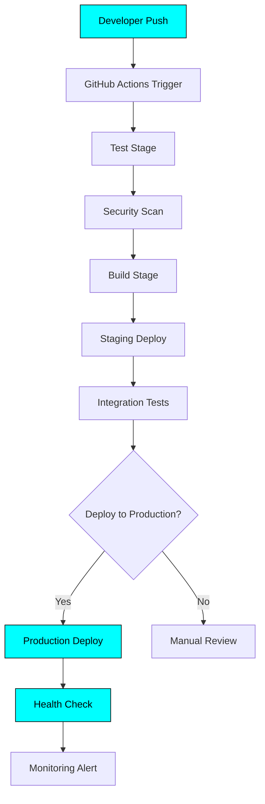
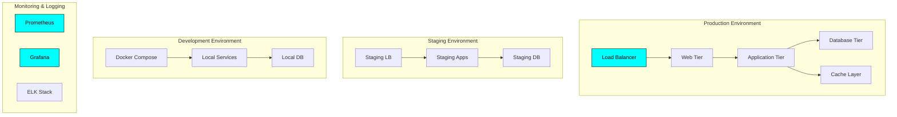
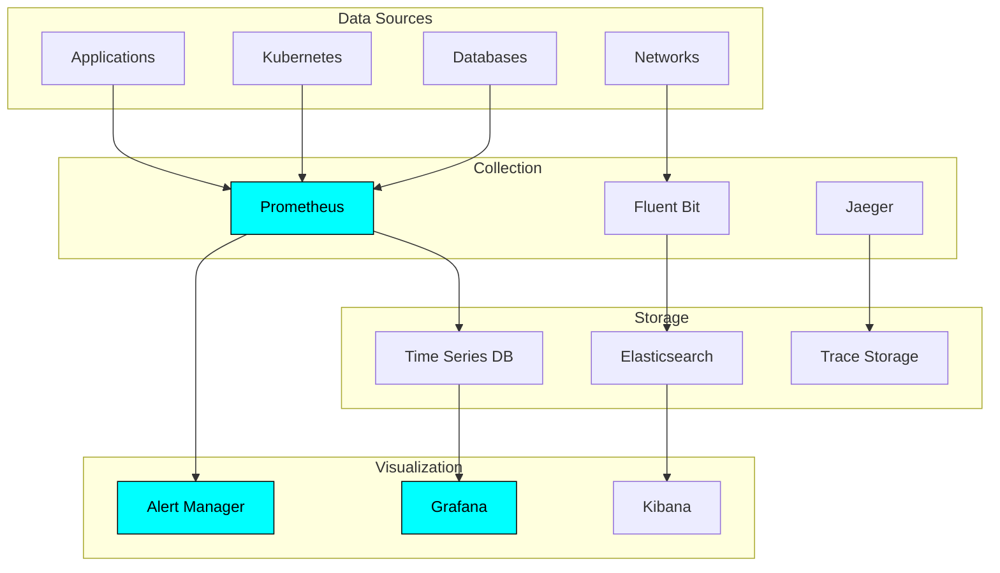
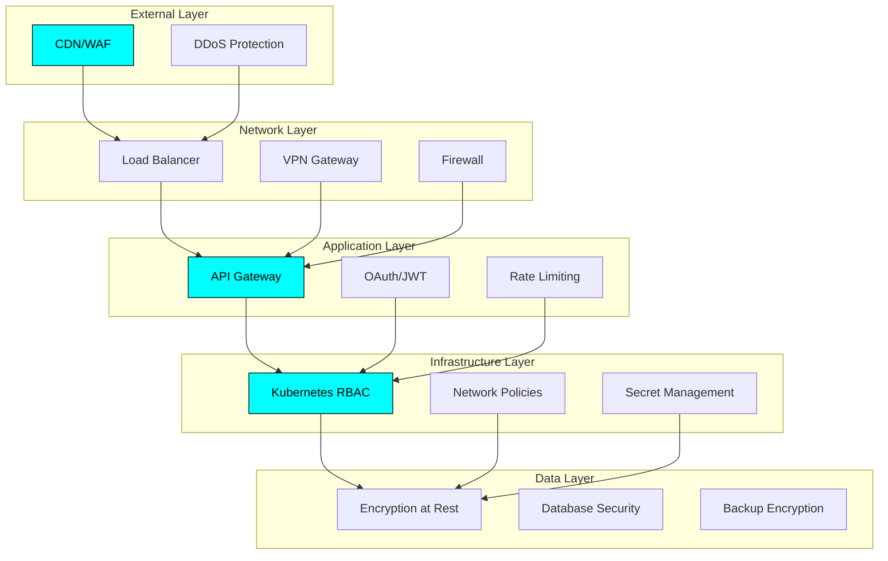

# 🏗️ Tiation Ecosystem Infrastructure Documentation

<div align="center">
  <h3>🚀 Enterprise-Grade CI/CD & Infrastructure Management</h3>
  <p>Comprehensive documentation for deployment, monitoring, and disaster recovery</p>
  
  
  
  
  
</div>

---

## 📋 Table of Contents

1. [**CI/CD Pipeline Documentation**](#-cicd-pipeline-documentation)
2. [**Infrastructure Architecture**](#-infrastructure-architecture)
3. [**Deployment Scripts & Automation**](#-deployment-scripts--automation)
4. [**Disaster Recovery & Rollback**](#-disaster-recovery--rollback)
5. [**Monitoring & Alerting**](#-monitoring--alerting)
6. [**Security & Compliance**](#-security--compliance)
7. [**Troubleshooting Guide**](#-troubleshooting-guide)
8. [**Appendices**](#-appendices)

---

## 🔄 CI/CD Pipeline Documentation

### Overview
Our CI/CD ecosystem leverages GitHub Actions for automated testing, building, and deployment across all repositories in the Tiation ecosystem.

### Pipeline Architecture



### Core Pipeline Components

#### 1. **Test Stage**
- **Purpose**: Ensure code quality and functionality
- **Tools**: Jest, Cypress, ESLint, TypeScript
- **Matrix Testing**: Node.js 18.x, 20.x
- **Coverage**: Minimum 80% code coverage requirement

```yaml
test:
  runs-on: ubuntu-latest
  strategy:
    matrix:
      node-version: [18.x, 20.x]
  steps:
    - name: Checkout code
      uses: actions/checkout@v4
    - name: Setup Node.js
      uses: actions/setup-node@v4
      with:
        node-version: ${{ matrix.node-version }}
        cache: 'npm'
    - name: Install dependencies
      run: npm ci
    - name: Run tests
      run: npm run test:coverage
```

#### 2. **Security Scanning**
- **Static Analysis**: CodeQL, Snyk
- **Dependency Scanning**: npm audit, Snyk
- **Secret Detection**: GitHub Secret Scanning
- **Compliance**: SOC2, HIPAA standards

#### 3. **Build Stage**
- **Docker Images**: Multi-stage builds for optimization
- **Artifacts**: Stored in GitHub Packages
- **Version Tagging**: Semantic versioning
- **Image Scanning**: Trivy for vulnerability detection

#### 4. **Deployment Stages**
- **Staging**: Automated deployment for integration testing
- **Production**: Manual approval required
- **Rollback**: Automated rollback on health check failures

### Repository-Specific Pipelines

#### Liberation System
- **Special Requirements**: Mesh network configuration
- **Deployment Target**: Kubernetes cluster
- **Health Checks**: Network connectivity, API responses
- **Monitoring**: Real-time metrics dashboard

#### Terminal Workflows
- **Special Requirements**: Terminal automation testing
- **Deployment Target**: Multiple environments
- **Health Checks**: Workflow execution validation
- **Monitoring**: Execution success rates

#### AI Agents Platform
- **Special Requirements**: ML model validation
- **Deployment Target**: GPU-enabled clusters
- **Health Checks**: Model inference performance
- **Monitoring**: Response time, accuracy metrics

---

## 🏗️ Infrastructure Architecture

### High-Level Architecture



### Infrastructure Components

#### 1. **Container Orchestration**
- **Platform**: Kubernetes (Production), Docker Compose (Development)
- **Registry**: GitHub Container Registry
- **Networking**: Istio service mesh
- **Storage**: Persistent volumes with backup

#### 2. **Database Infrastructure**
- **Primary**: PostgreSQL with high availability
- **Cache**: Redis cluster
- **Backup**: Automated daily backups with 30-day retention
- **Monitoring**: Connection pooling, query performance

#### 3. **Networking**
- **Load Balancing**: NGINX Ingress Controller
- **SSL/TLS**: Let's Encrypt certificates
- **VPN**: WireGuard for secure access
- **CDN**: CloudFlare for static assets

#### 4. **Security**
- **Identity**: OAuth 2.0 with JWT tokens
- **Secrets**: Kubernetes secrets, encrypted at rest
- **Network**: Network policies, firewall rules
- **Compliance**: Regular security audits

### Environment Specifications

#### Production Environment
- **Compute**: 3 nodes, 8 vCPU, 32GB RAM each
- **Storage**: 500GB SSD with automated backups
- **Network**: 10Gbps dedicated bandwidth
- **Availability**: 99.9% uptime SLA

#### Staging Environment
- **Compute**: 2 nodes, 4 vCPU, 16GB RAM each
- **Storage**: 200GB SSD
- **Network**: 1Gbps shared bandwidth
- **Purpose**: Integration testing, performance validation

#### Development Environment
- **Platform**: Docker Compose on local machines
- **Services**: All services containerized
- **Data**: Anonymized production data subsets
- **Purpose**: Feature development, unit testing

---

## 🚀 Deployment Scripts & Automation

### Deployment Automation Framework

Our deployment system uses a combination of shell scripts, Docker Compose, and Kubernetes manifests for consistent deployments across all environments.

#### Core Deployment Scripts

##### 1. **Master Deployment Script**
```bash
#!/bin/bash
# deploy.sh - Master deployment orchestrator

set -e

ENVIRONMENT=${1:-staging}
SERVICE=${2:-all}
VERSION=${3:-latest}

echo "🚀 Starting deployment to $ENVIRONMENT"
echo "📦 Service: $SERVICE"
echo "🏷️  Version: $VERSION"

# Pre-deployment checks
./scripts/pre-deploy-check.sh $ENVIRONMENT

# Deploy services
case $SERVICE in
    "all")
        ./scripts/deploy-liberation-system.sh $ENVIRONMENT $VERSION
        ./scripts/deploy-ai-agents.sh $ENVIRONMENT $VERSION
        ./scripts/deploy-terminal-workflows.sh $ENVIRONMENT $VERSION
        ./scripts/deploy-cms.sh $ENVIRONMENT $VERSION
        ;;
    "liberation")
        ./scripts/deploy-liberation-system.sh $ENVIRONMENT $VERSION
        ;;
    "ai-agents")
        ./scripts/deploy-ai-agents.sh $ENVIRONMENT $VERSION
        ;;
    *)
        echo "❌ Unknown service: $SERVICE"
        exit 1
        ;;
esac

# Post-deployment verification
./scripts/post-deploy-check.sh $ENVIRONMENT

echo "✅ Deployment completed successfully"
```

##### 2. **Pre-Deployment Checks**
```bash
#!/bin/bash
# pre-deploy-check.sh - Pre-deployment validation

ENVIRONMENT=$1

echo "🔍 Running pre-deployment checks for $ENVIRONMENT"

# Check cluster connectivity
kubectl cluster-info --context=$ENVIRONMENT

# Check resource availability
kubectl top nodes --context=$ENVIRONMENT

# Verify secrets exist
kubectl get secrets --context=$ENVIRONMENT

# Check external dependencies
./scripts/check-dependencies.sh

echo "✅ Pre-deployment checks passed"
```

##### 3. **Health Check Script**
```bash
#!/bin/bash
# health-check.sh - Post-deployment health verification

ENVIRONMENT=$1
TIMEOUT=300

echo "🏥 Running health checks for $ENVIRONMENT"

# Check all services are running
kubectl get pods --context=$ENVIRONMENT -l app.kubernetes.io/name=tiation

# Wait for services to be ready
kubectl wait --for=condition=ready pod --context=$ENVIRONMENT -l app.kubernetes.io/name=tiation --timeout=${TIMEOUT}s

# Run integration tests
npm run test:integration:$ENVIRONMENT

echo "✅ Health checks passed"
```

#### Infrastructure as Code

##### Kubernetes Manifests Structure
```
infrastructure/
├── kubernetes/
│   ├── base/
│   │   ├── liberation-system/
│   │   │   ├── deployment.yaml
│   │   │   ├── service.yaml
│   │   │   └── configmap.yaml
│   │   ├── ai-agents/
│   │   └── terminal-workflows/
│   ├── overlays/
│   │   ├── staging/
│   │   └── production/
│   └── monitoring/
├── docker-compose/
│   ├── development.yml
│   ├── staging.yml
│   └── production.yml
└── scripts/
    ├── deploy.sh
    ├── rollback.sh
    └── monitoring.sh
```

##### Docker Compose Configuration
```yaml
# docker-compose.production.yml
version: '3.8'

services:
  liberation-system:
    image: ghcr.io/tiation/liberation-system:${VERSION:-latest}
    restart: unless-stopped
    environment:
      - NODE_ENV=production
      - DATABASE_URL=${DATABASE_URL}
      - REDIS_URL=${REDIS_URL}
    networks:
      - tiation-network
    healthcheck:
      test: ["CMD", "curl", "-f", "http://localhost:3000/health"]
      interval: 30s
      timeout: 10s
      retries: 3

  ai-agents:
    image: ghcr.io/tiation/ai-agents:${VERSION:-latest}
    restart: unless-stopped
    environment:
      - NODE_ENV=production
      - AI_MODEL_PATH=/models
    volumes:
      - ai-models:/models
    networks:
      - tiation-network

networks:
  tiation-network:
    driver: bridge

volumes:
  ai-models:
    driver: local
```

---

## 🔧 Disaster Recovery & Rollback

### Disaster Recovery Strategy

Our disaster recovery plan ensures maximum uptime and data protection with automated failover and recovery procedures.

#### Recovery Time Objectives (RTO)
- **Critical Services**: 5 minutes
- **Standard Services**: 15 minutes
- **Development Services**: 1 hour

#### Recovery Point Objectives (RPO)
- **Database**: 15 minutes (continuous replication)
- **File Storage**: 1 hour (automated backups)
- **Configuration**: Real-time (version control)

### Backup Strategy

#### 1. **Database Backups**
```bash
#!/bin/bash
# backup-database.sh - Automated database backup

TIMESTAMP=$(date +%Y%m%d_%H%M%S)
BACKUP_DIR="/backups/database"
DATABASE_NAME="tiation_prod"

echo "📦 Starting database backup: $TIMESTAMP"

# Create backup
pg_dump -h $DB_HOST -U $DB_USER -d $DATABASE_NAME > $BACKUP_DIR/backup_$TIMESTAMP.sql

# Compress backup
gzip $BACKUP_DIR/backup_$TIMESTAMP.sql

# Upload to S3
aws s3 cp $BACKUP_DIR/backup_$TIMESTAMP.sql.gz s3://tiation-backups/database/

# Cleanup old backups (keep 30 days)
find $BACKUP_DIR -name "backup_*.sql.gz" -mtime +30 -delete

echo "✅ Database backup completed: backup_$TIMESTAMP.sql.gz"
```

#### 2. **Configuration Backups**
```bash
#!/bin/bash
# backup-config.sh - Kubernetes configuration backup

TIMESTAMP=$(date +%Y%m%d_%H%M%S)
BACKUP_DIR="/backups/config"

echo "⚙️  Starting configuration backup: $TIMESTAMP"

# Export all Kubernetes configurations
kubectl get all --all-namespaces -o yaml > $BACKUP_DIR/k8s-config_$TIMESTAMP.yaml

# Export secrets (encrypted)
kubectl get secrets --all-namespaces -o yaml | gpg --encrypt --recipient admin@tiation.com > $BACKUP_DIR/secrets_$TIMESTAMP.yaml.gpg

# Upload to S3
aws s3 cp $BACKUP_DIR/k8s-config_$TIMESTAMP.yaml s3://tiation-backups/config/
aws s3 cp $BACKUP_DIR/secrets_$TIMESTAMP.yaml.gpg s3://tiation-backups/config/

echo "✅ Configuration backup completed"
```

### Rollback Procedures

#### 1. **Automated Rollback**
```bash
#!/bin/bash
# rollback.sh - Automated service rollback

SERVICE=$1
ENVIRONMENT=$2
PREVIOUS_VERSION=$3

echo "🔄 Starting rollback for $SERVICE in $ENVIRONMENT"

case $SERVICE in
    "liberation-system")
        kubectl rollout undo deployment/liberation-system --context=$ENVIRONMENT
        ;;
    "ai-agents")
        kubectl rollout undo deployment/ai-agents --context=$ENVIRONMENT
        ;;
    *)
        echo "❌ Unknown service: $SERVICE"
        exit 1
        ;;
esac

# Wait for rollback to complete
kubectl rollout status deployment/$SERVICE --context=$ENVIRONMENT --timeout=300s

# Run health checks
./scripts/health-check.sh $ENVIRONMENT

echo "✅ Rollback completed successfully"
```

#### 2. **Database Rollback**
```bash
#!/bin/bash
# rollback-database.sh - Database rollback procedure

BACKUP_FILE=$1
DATABASE_NAME="tiation_prod"

echo "🔄 Starting database rollback from: $BACKUP_FILE"

# Stop application services
kubectl scale deployment --replicas=0 --all --context=production

# Download backup from S3
aws s3 cp s3://tiation-backups/database/$BACKUP_FILE /tmp/

# Restore database
gunzip -c /tmp/$BACKUP_FILE | psql -h $DB_HOST -U $DB_USER -d $DATABASE_NAME

# Restart application services
kubectl scale deployment --replicas=3 --all --context=production

echo "✅ Database rollback completed"
```

### Disaster Recovery Runbook

#### 1. **Complete System Failure**
```markdown
## Complete System Failure Recovery

### Immediate Actions (0-5 minutes)
1. **Assess Impact**
   - Check monitoring dashboards
   - Verify external dependencies
   - Communicate with team

2. **Activate Backup Infrastructure**
   - Switch to backup cluster
   - Update DNS records
   - Notify users of maintenance

3. **Restore Services**
   - Deploy from latest known good configuration
   - Restore database from most recent backup
   - Verify all services are operational

### Recovery Steps (5-30 minutes)
1. **Data Recovery**
   - Restore from most recent backup
   - Verify data integrity
   - Test critical workflows

2. **Service Restoration**
   - Deploy all services to backup infrastructure
   - Run comprehensive health checks
   - Verify external integrations

3. **User Communication**
   - Update status page
   - Notify stakeholders
   - Provide ETAs for full restoration
```

#### 2. **Partial Service Failure**
```markdown
## Partial Service Failure Recovery

### Assessment (0-2 minutes)
1. Identify affected services
2. Check service dependencies
3. Determine impact scope

### Recovery Actions (2-10 minutes)
1. **Isolate Failed Service**
   - Stop affected service
   - Prevent cascade failures
   - Reroute traffic if possible

2. **Restore Service**
   - Rollback to previous version
   - Restore from backup if needed
   - Verify service health

3. **Validation**
   - Run health checks
   - Test critical workflows
   - Monitor for stability
```

---

## 📊 Monitoring & Alerting

### Monitoring Architecture

Our monitoring system provides comprehensive visibility into system health, performance, and security across all environments.



### Key Metrics & Alerts

#### 1. **System Health Metrics**
```yaml
# prometheus-alerts.yml
groups:
  - name: system-health
    rules:
      - alert: HighCPUUsage
        expr: cpu_usage_percent > 80
        for: 5m
        labels:
          severity: warning
        annotations:
          summary: "High CPU usage detected"
          description: "CPU usage is above 80% for 5 minutes"

      - alert: HighMemoryUsage
        expr: memory_usage_percent > 85
        for: 5m
        labels:
          severity: warning
        annotations:
          summary: "High memory usage detected"
          description: "Memory usage is above 85% for 5 minutes"

      - alert: DiskSpaceLow
        expr: disk_free_percent < 20
        for: 2m
        labels:
          severity: critical
        annotations:
          summary: "Low disk space"
          description: "Disk space is below 20%"
```

#### 2. **Application Performance Metrics**
```yaml
  - name: application-performance
    rules:
      - alert: HighResponseTime
        expr: http_request_duration_seconds > 2
        for: 5m
        labels:
          severity: warning
        annotations:
          summary: "High response time detected"
          description: "Response time is above 2 seconds for 5 minutes"

      - alert: HighErrorRate
        expr: http_requests_total{status=~"5.."}
        for: 2m
        labels:
          severity: critical
        annotations:
          summary: "High error rate detected"
          description: "Error rate is above normal thresholds"
```

#### 3. **Business Metrics**
```yaml
  - name: business-metrics
    rules:
      - alert: LowUserActivity
        expr: active_users < 100
        for: 30m
        labels:
          severity: warning
        annotations:
          summary: "Low user activity detected"
          description: "Active users below expected threshold"

      - alert: DatabaseConnectionIssue
        expr: database_connections_active < 1
        for: 1m
        labels:
          severity: critical
        annotations:
          summary: "Database connection issue"
          description: "No active database connections"
```

### Grafana Dashboards

#### 1. **System Overview Dashboard**
```json
{
  "dashboard": {
    "title": "Tiation System Overview",
    "panels": [
      {
        "title": "System Health",
        "type": "stat",
        "targets": [
          {
            "expr": "up",
            "legendFormat": "{{ instance }}"
          }
        ]
      },
      {
        "title": "Response Time",
        "type": "graph",
        "targets": [
          {
            "expr": "histogram_quantile(0.95, rate(http_request_duration_seconds_bucket[5m]))",
            "legendFormat": "95th percentile"
          }
        ]
      },
      {
        "title": "Error Rate",
        "type": "graph",
        "targets": [
          {
            "expr": "rate(http_requests_total{status=~\"5..\"}[5m])",
            "legendFormat": "Error rate"
          }
        ]
      }
    ]
  }
}
```

#### 2. **Application-Specific Dashboards**
- **Liberation System**: Mesh network performance, resource distribution metrics
- **AI Agents**: Model inference time, accuracy metrics, resource utilization
- **Terminal Workflows**: Execution success rate, completion time, resource usage

### Alert Escalation

#### 1. **Alert Levels**
```yaml
# Alert severity levels and escalation
levels:
  - name: info
    channels: [slack]
    escalation_delay: none
    
  - name: warning
    channels: [slack, email]
    escalation_delay: 15m
    
  - name: critical
    channels: [slack, email, pagerduty]
    escalation_delay: 5m
    
  - name: emergency
    channels: [slack, email, pagerduty, phone]
    escalation_delay: 1m
```

#### 2. **On-Call Rotation**
```yaml
# PagerDuty configuration
schedules:
  - name: primary-oncall
    time_zone: "UTC"
    layers:
      - start: "2024-01-01T00:00:00Z"
        rotation_virtual_start: "2024-01-01T00:00:00Z"
        rotation_turn_length_seconds: 604800  # 1 week
        users:
          - primary-engineer
          - secondary-engineer
          - platform-engineer
```

---

## 🔐 Security & Compliance

### Security Architecture

Our security model implements defense-in-depth with multiple layers of protection and continuous monitoring.



### Security Policies

#### 1. **Access Control**
```yaml
# rbac.yaml - Role-Based Access Control
apiVersion: rbac.authorization.k8s.io/v1
kind: Role
metadata:
  namespace: tiation-prod
  name: deployment-manager
rules:
- apiGroups: ["apps"]
  resources: ["deployments"]
  verbs: ["get", "list", "watch", "create", "update", "patch", "delete"]
- apiGroups: [""]
  resources: ["pods", "services"]
  verbs: ["get", "list", "watch"]
```

#### 2. **Network Security**
```yaml
# network-policy.yaml
apiVersion: networking.k8s.io/v1
kind: NetworkPolicy
metadata:
  name: tiation-network-policy
  namespace: tiation-prod
spec:
  podSelector:
    matchLabels:
      app: tiation
  policyTypes:
  - Ingress
  - Egress
  ingress:
  - from:
    - namespaceSelector:
        matchLabels:
          name: tiation-prod
    ports:
    - protocol: TCP
      port: 3000
  egress:
  - to:
    - namespaceSelector:
        matchLabels:
          name: tiation-prod
    ports:
    - protocol: TCP
      port: 5432
```

#### 3. **Secret Management**
```bash
#!/bin/bash
# secret-rotation.sh - Automated secret rotation

NAMESPACE="tiation-prod"
SECRET_NAME="database-credentials"

echo "🔐 Starting secret rotation for $SECRET_NAME"

# Generate new password
NEW_PASSWORD=$(openssl rand -base64 32)

# Update database user
psql -h $DB_HOST -U $DB_ADMIN -c "ALTER USER $DB_USER PASSWORD '$NEW_PASSWORD';"

# Update Kubernetes secret
kubectl create secret generic $SECRET_NAME \
  --from-literal=password=$NEW_PASSWORD \
  --namespace=$NAMESPACE \
  --dry-run=client -o yaml | kubectl apply -f -

# Restart pods to pick up new secret
kubectl rollout restart deployment/liberation-system --namespace=$NAMESPACE

echo "✅ Secret rotation completed"
```

### Compliance Framework

#### 1. **SOC 2 Compliance**
```yaml
# Security controls for SOC 2 compliance
controls:
  - id: CC1.1
    description: "Information Security Policies"
    implementation: "Documented security policies in place"
    evidence: "docs/security-policies.md"
    
  - id: CC2.1
    description: "System Monitoring"
    implementation: "24/7 monitoring with Prometheus/Grafana"
    evidence: "monitoring/prometheus-config.yml"
    
  - id: CC3.1
    description: "Risk Assessment"
    implementation: "Quarterly risk assessments"
    evidence: "security/risk-assessment-Q1-2024.pdf"
```

#### 2. **Data Protection**
```yaml
# GDPR compliance measures
data_protection:
  - type: "Personal Data Inventory"
    location: "docs/data-inventory.md"
    last_updated: "2024-01-01"
    
  - type: "Data Retention Policy"
    location: "docs/data-retention-policy.md"
    retention_period: "7 years"
    
  - type: "Privacy Impact Assessment"
    location: "docs/privacy-impact-assessment.pdf"
    assessment_date: "2024-01-01"
```

### Security Monitoring

#### 1. **Intrusion Detection**
```yaml
# Falco rules for intrusion detection
- rule: Detect shell in container
  desc: Detect shell spawned in container
  condition: >
    spawned_process and container and
    (proc.name in (shell_binaries) or
     proc.name in (shell_mgmt_binaries))
  output: >
    Shell spawned in container
    (user=%user.name container=%container.name
     image=%container.image.repository:%container.image.tag
     shell=%proc.name)
  priority: WARNING
```

#### 2. **Vulnerability Scanning**
```yaml
# Trivy scanning configuration
trivy:
  image_scanning:
    enabled: true
    severity: HIGH,CRITICAL
    ignore_unfixed: false
    
  filesystem_scanning:
    enabled: true
    scan_paths:
      - "/app"
      - "/usr/local/bin"
      
  secret_scanning:
    enabled: true
    patterns:
      - "password"
      - "token"
      - "key"
```

---

## 🔧 Troubleshooting Guide

### Common Issues and Solutions

#### 1. **Deployment Failures**

##### **Issue**: Container fails to start
```bash
# Diagnosis
kubectl describe pod <pod-name> -n <namespace>
kubectl logs <pod-name> -n <namespace>

# Common causes and solutions
# 1. Image pull errors
kubectl get events --field-selector involvedObject.name=<pod-name>

# 2. Resource constraints
kubectl top node
kubectl describe node <node-name>

# 3. Configuration issues
kubectl get configmap -n <namespace>
kubectl describe configmap <config-name> -n <namespace>
```

##### **Issue**: Service not accessible
```bash
# Check service configuration
kubectl get svc -n <namespace>
kubectl describe svc <service-name> -n <namespace>

# Check endpoints
kubectl get endpoints -n <namespace>

# Check ingress
kubectl get ingress -n <namespace>
kubectl describe ingress <ingress-name> -n <namespace>
```

#### 2. **Performance Issues**

##### **Issue**: High response times
```bash
# Check application metrics
curl -s http://prometheus:9090/api/v1/query?query=http_request_duration_seconds

# Check database performance
kubectl exec -it <db-pod> -- psql -c "SELECT * FROM pg_stat_activity;"

# Check resource utilization
kubectl top pods -n <namespace>
kubectl top nodes
```

##### **Issue**: Memory leaks
```bash
# Monitor memory usage over time
kubectl top pods -n <namespace> --sort-by=memory

# Check for memory limits
kubectl describe pod <pod-name> -n <namespace> | grep -i memory

# Generate heap dump (Node.js)
kubectl exec -it <pod-name> -- kill -USR2 <process-id>
```

#### 3. **Network Issues**

##### **Issue**: Service discovery problems
```bash
# Check DNS resolution
kubectl exec -it <pod-name> -- nslookup <service-name>

# Check CoreDNS
kubectl get pods -n kube-system | grep coredns
kubectl logs <coredns-pod> -n kube-system

# Check service mesh (if using Istio)
istioctl proxy-config cluster <pod-name>
```

##### **Issue**: Connection timeouts
```bash
# Check network policies
kubectl get networkpolicies -n <namespace>

# Check firewall rules
iptables -L

# Test connectivity
kubectl exec -it <pod-name> -- telnet <service-name> <port>
```

### Debugging Procedures

#### 1. **Application Debugging**
```bash
#!/bin/bash
# debug-application.sh - Application debugging script

POD_NAME=$1
NAMESPACE=${2:-default}

echo "🔍 Debugging application: $POD_NAME in $NAMESPACE"

# Get pod information
kubectl describe pod $POD_NAME -n $NAMESPACE

# Check logs
kubectl logs $POD_NAME -n $NAMESPACE --tail=100

# Check previous logs if pod restarted
kubectl logs $POD_NAME -n $NAMESPACE --previous

# Get shell access
kubectl exec -it $POD_NAME -n $NAMESPACE -- /bin/bash

# Check environment variables
kubectl exec $POD_NAME -n $NAMESPACE -- env

# Check file system
kubectl exec $POD_NAME -n $NAMESPACE -- df -h
kubectl exec $POD_NAME -n $NAMESPACE -- ls -la /app
```

#### 2. **Database Debugging**
```bash
#!/bin/bash
# debug-database.sh - Database debugging script

DB_POD=$1
NAMESPACE=${2:-default}

echo "🔍 Debugging database: $DB_POD in $NAMESPACE"

# Check database connections
kubectl exec -it $DB_POD -n $NAMESPACE -- psql -c "SELECT * FROM pg_stat_activity;"

# Check database size
kubectl exec -it $DB_POD -n $NAMESPACE -- psql -c "SELECT pg_size_pretty(pg_database_size('tiation'));"

# Check slow queries
kubectl exec -it $DB_POD -n $NAMESPACE -- psql -c "SELECT query, calls, total_time FROM pg_stat_statements ORDER BY total_time DESC LIMIT 10;"

# Check table statistics
kubectl exec -it $DB_POD -n $NAMESPACE -- psql -c "SELECT * FROM pg_stat_user_tables;"
```

#### 3. **Network Debugging**
```bash
#!/bin/bash
# debug-network.sh - Network debugging script

SOURCE_POD=$1
TARGET_SERVICE=$2
NAMESPACE=${3:-default}

echo "🔍 Debugging network connectivity: $SOURCE_POD -> $TARGET_SERVICE"

# Test DNS resolution
kubectl exec -it $SOURCE_POD -n $NAMESPACE -- nslookup $TARGET_SERVICE

# Test connectivity
kubectl exec -it $SOURCE_POD -n $NAMESPACE -- ping -c 3 $TARGET_SERVICE

# Test port connectivity
kubectl exec -it $SOURCE_POD -n $NAMESPACE -- telnet $TARGET_SERVICE 80

# Check routing
kubectl exec -it $SOURCE_POD -n $NAMESPACE -- traceroute $TARGET_SERVICE

# Check iptables rules
kubectl exec -it $SOURCE_POD -n $NAMESPACE -- iptables -L
```

---

## 📋 Appendices

### Appendix A: Emergency Contacts

#### On-Call Rotation
```yaml
primary_oncall:
  name: "Primary Engineer"
  phone: "+1-555-0101"
  email: "primary@tiation.com"
  slack: "@primary-engineer"

secondary_oncall:
  name: "Secondary Engineer"
  phone: "+1-555-0102"
  email: "secondary@tiation.com"
  slack: "@secondary-engineer"

platform_team:
  name: "Platform Team Lead"
  phone: "+1-555-0103"
  email: "platform@tiation.com"
  slack: "@platform-lead"
```

#### External Vendors
```yaml
aws_support:
  level: "Enterprise"
  phone: "+1-206-266-4064"
  case_url: "https://console.aws.amazon.com/support/"

github_support:
  level: "Enterprise"
  email: "enterprise@github.com"
  portal: "https://enterprise.github.com/support"

monitoring_vendor:
  name: "DataDog"
  support_email: "support@datadoghq.com"
  emergency_phone: "+1-866-329-4466"
```

### Appendix B: Runbook Templates

#### Service Restart Runbook
```markdown
## Service Restart Runbook

### Prerequisites
- [ ] Verify issue requires restart
- [ ] Check for ongoing deployments
- [ ] Notify team in #incidents channel

### Steps
1. **Identify affected service**
   ```bash
   kubectl get pods -n <namespace> | grep <service-name>
   ```

2. **Check service health**
   ```bash
   kubectl describe pod <pod-name> -n <namespace>
   kubectl logs <pod-name> -n <namespace>
   ```

3. **Restart service**
   ```bash
   kubectl rollout restart deployment/<service-name> -n <namespace>
   ```

4. **Verify restart**
   ```bash
   kubectl rollout status deployment/<service-name> -n <namespace>
   ```

5. **Run health checks**
   ```bash
   ./scripts/health-check.sh <environment>
   ```

### Rollback Plan
If restart fails:
1. Rollback to previous version
2. Check logs for errors
3. Escalate to platform team
```

### Appendix C: Configuration Templates

#### Monitoring Configuration
```yaml
# monitoring-config.yaml
apiVersion: v1
kind: ConfigMap
metadata:
  name: monitoring-config
  namespace: monitoring
data:
  prometheus.yml: |
    global:
      scrape_interval: 15s
      evaluation_interval: 15s
    
    scrape_configs:
      - job_name: 'kubernetes-pods'
        kubernetes_sd_configs:
          - role: pod
        relabel_configs:
          - source_labels: [__meta_kubernetes_pod_annotation_prometheus_io_scrape]
            action: keep
            regex: true
          - source_labels: [__meta_kubernetes_pod_annotation_prometheus_io_path]
            action: replace
            target_label: __metrics_path__
            regex: (.+)
```

#### Alerting Configuration
```yaml
# alerting-config.yaml
apiVersion: v1
kind: ConfigMap
metadata:
  name: alerting-config
  namespace: monitoring
data:
  alertmanager.yml: |
    global:
      smtp_smarthost: 'localhost:587'
      smtp_from: 'alerts@tiation.com'
    
    route:
      group_by: ['alertname']
      group_wait: 10s
      group_interval: 10s
      repeat_interval: 1h
      receiver: 'web.hook'
    
    receivers:
      - name: 'web.hook'
        webhook_configs:
          - url: 'http://slack-webhook/alerts'
```

### Appendix D: Compliance Checklists

#### SOC 2 Compliance Checklist
```markdown
## SOC 2 Compliance Checklist

### Security (CC1-CC3)
- [ ] Information security policies documented
- [ ] Access controls implemented
- [ ] Risk assessment completed
- [ ] Vulnerability management process
- [ ] Incident response procedures

### Availability (A1)
- [ ] System availability monitoring
- [ ] Backup and recovery procedures
- [ ] Disaster recovery plan
- [ ] Performance monitoring
- [ ] Capacity planning

### Processing Integrity (PI1)
- [ ] Data processing controls
- [ ] Error handling procedures
- [ ] Data validation processes
- [ ] System processing monitoring
- [ ] Change management procedures

### Confidentiality (C1)
- [ ] Data classification policies
- [ ] Encryption at rest and in transit
- [ ] Access control mechanisms
- [ ] Data retention policies
- [ ] Secure disposal procedures

### Privacy (P1)
- [ ] Privacy notice provided
- [ ] Data subject rights procedures
- [ ] Data retention policies
- [ ] Consent management
- [ ] Data breach response procedures
```

---

<div align="center">
  <h3>🌟 Infrastructure Excellence</h3>
  <p>This documentation ensures enterprise-grade infrastructure management across the entire Tiation ecosystem</p>
  
  
  
  
</div>

---

*This documentation is part of the [Tiation](https://github.com/tiation) ecosystem infrastructure management suite*

**Last Updated**: January 2024  
**Version**: 1.0.0  
**Maintained by**: Tiation Platform Team
