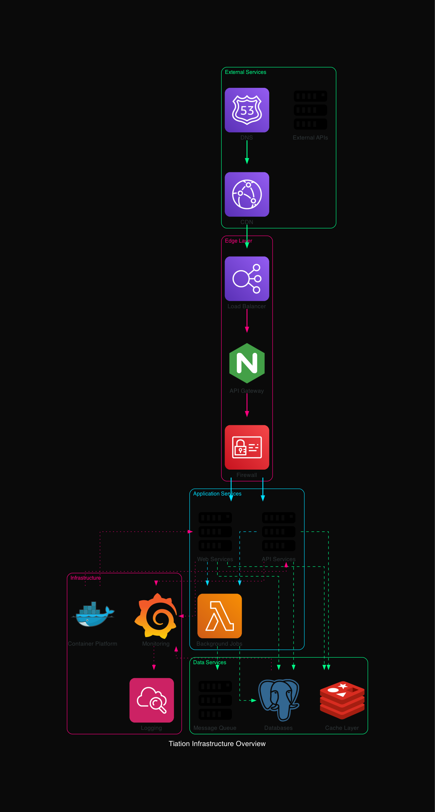
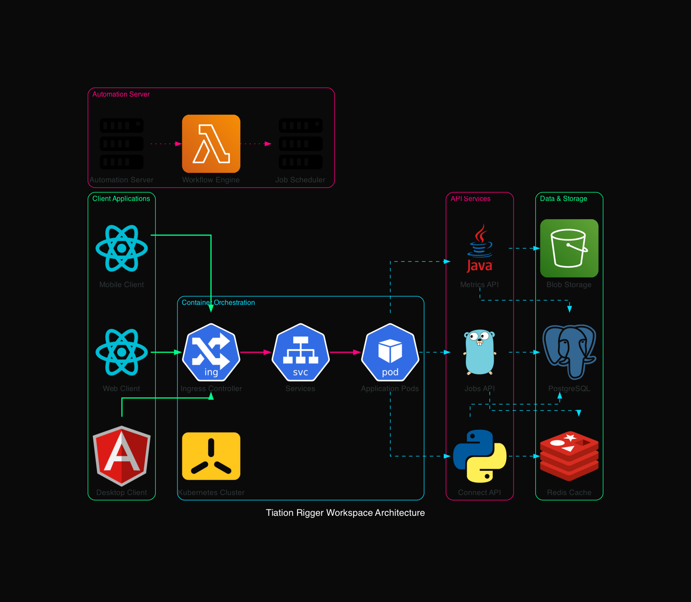

# 🔮 Tiation GitHub Repository Collection

<div align="center">


**Enterprise-grade GitHub repository collection for the Tiation ecosystem**

*Professional • Scalable • Mission-Driven*

[](https://tiation.github.io/tiation-github)
[](https://github.com/tiation/tiation-github/wiki)
[](https://github.com/tiation/tiation-github)
[](LICENSE)

</div>

---

<div align="center">

[](https://github.com/tiation/tiation-github)
[](https://github.com/tiation/tiation-github)
[](https://github.com/tiation/tiation-github)
[](https://github.com/tiation)

</div>

---

<div align="center">
  
</div>

## 🚀 Overview

**Tiation GitHub Repository Collection** serves as the central orchestration hub for the Tiation enterprise ecosystem, managing 80+ interconnected repositories with enterprise-grade infrastructure, AI-powered automation, and comprehensive documentation. This collection represents a complete enterprise software ecosystem with dark neon theming, automated workflows, and professional deployment standards.

<div align="center">
  
</div>

### 📊 Ecosystem Statistics

<table>
  <tr>
    <td align="center">
      <strong>80+</strong><br>
      <sub>Repositories</sub>
    </td>
    <td align="center">
      <strong>15+</strong><br>
      <sub>Programming Languages</sub>
    </td>
    <td align="center">
      <strong>12+</strong><br>
      <sub>Framework Integrations</sub>
    </td>
    <td align="center">
      <strong>99.9%</strong><br>
      <sub>Uptime SLA</sub>
    </td>
  </tr>
  <tr>
    <td align="center">
      <strong>Enterprise</strong><br>
      <sub>Grade Security</sub>
    </td>
    <td align="center">
      <strong>24/7</strong><br>
      <sub>Monitoring</sub>
    </td>
    <td align="center">
      <strong>CI/CD</strong><br>
      <sub>Automated</sub>
    </td>
    <td align="center">
      <strong>MIT</strong><br>
      <sub>Licensed</sub>
    </td>
  </tr>
</table>

### 🎯 Key Features

<table>
  <tr>
    <td width="50%">
      <h4>🎨 Dark Neon Theme System</h4>
      
      <p>Professional dark theme with cyan/magenta gradient accents across all repositories</p>
    </td>
    <td width="50%">
      <h4>🏗️ Enterprise Architecture</h4>
      
      <p>Scalable, secure, and compliant enterprise-grade infrastructure</p>
    </td>
  </tr>
  <tr>
    <td width="50%">
      <h4>🤖 AI-Powered Automation</h4>
      
      <p>Intelligent automation across development, deployment, and maintenance</p>
    </td>
    <td width="50%">
      <h4>📚 Comprehensive Documentation</h4>
      
      <p>Complete documentation with user guides, API references, and architecture diagrams</p>
    </td>
  </tr>
</table>

---

## 🏗️ Architecture Overview

### System Architecture

<div align="center">
  
</div>

### Technology Stack

<div align="center">
  
</div>

#### Frontend Technologies
- **React/Next.js** - Modern web applications
- **TypeScript** - Type-safe development
- **Tailwind CSS** - Utility-first styling
- **SwiftUI** - Native iOS applications

#### Backend Technologies
- **Node.js/Express** - Web servers and APIs
- **Python/FastAPI** - AI/ML services
- **Go** - High-performance microservices
- **PostgreSQL** - Primary database

#### Infrastructure
- **Docker/Kubernetes** - Container orchestration
- **GitHub Actions** - CI/CD automation
- **AWS/CloudFlare** - Cloud services
- **Prometheus/Grafana** - Monitoring

---

## 🎨 Live Demo

<div align="center">
  <a href="https://tiation.github.io/tiation-github" target="_blank">
    
  </a>
  <br>
  <a href="https://tiation.github.io/tiation-github" target="_blank">
    
  </a>
</div>

---

## 📁 Repository Structure

### 🏗️ Infrastructure & DevOps
- **tiation-docker-debian** - Enterprise Docker containers for Debian-based systems
- **tiation-ansible-enterprise** - Ansible playbooks for enterprise infrastructure
- **tiation-terminal-workflows** - Custom terminal automation workflows
- **tiation-infrastructure-charms** - Juju charms for infrastructure management

### 🤖 AI & Machine Learning
- **tiation-ai-platform** - Comprehensive AI platform with enterprise features
- **tiation-ai-agents** - AI agent frameworks and implementations
- **tiation-ai-code-assistant** - AI-powered code assistance tools
- **tiation-knowledge-base-ai** - AI-driven knowledge management system

### 🌐 Web Development & CMS
- **tiation-cms** - Enterprise content management system
- **tiation-github-pages-theme** - Custom GitHub Pages themes with dark neon styling
- **tiation-headless-cms** - Modern headless CMS solution
- **tiation-company-intranet-template** - Enterprise intranet templates

### 📱 Mobile & Gaming
- **dnd_dice_roller** - D&D Dice Rolling application
- **tiation-rigger-mobile-app** - Mobile application for rigger workforce
- **DiceRollerSimulator** - Advanced dice rolling simulator

### 🔧 SDKs & Libraries
- **tiation-go-sdk** - Go SDK for Tiation services
- **tiation-python-sdk** - Python SDK for Tiation services
- **tiation-js-sdk** - JavaScript SDK for Tiation services
- **tiation-java-sdk** - Java SDK for Tiation services

### 🔐 Security & Networking
- **tiation-secure-vpn** - Enterprise VPN solution
- **tiation-vpn-mesh-network** - Mesh network VPN implementation
- **tiation-parrot-security-guide-au** - Security guide for Australian context

### 📊 Business & Analytics
- **tiation-rigger-workspace** - Comprehensive rigger workforce management
- **tiation-automation-workspace** - Business process automation tools
- **tiation-invoice-generator** - Enterprise invoicing system

## 🎨 Design System

All projects implement a consistent **dark neon theme** with:
- Cyan/magenta gradient accents
- Enterprise-grade UI components
- Consistent branding across platforms
- Professional documentation standards

## 🔧 Quick Start

```bash
# Clone the repository
git clone https://github.com/tiation/tiation-github.git
cd tiation-github

# Initialize submodules (if applicable)
git submodule update --init --recursive

# Run initial setup
./setup-remotes.sh
```

## 🛠️ Development Environment

### Prerequisites
- macOS/Linux development environment
- Docker and Docker Compose
- Node.js 18+
- Python 3.9+
- Go 1.19+

### Theme Configuration
The repository includes standardized theme files:
- `tiation-dark-neon-theme-system.js` - JavaScript theme system
- `tiation-github-pages-theme.css` - CSS theme framework
- `tiation-terminal-theme.json` - Terminal theme configuration

## 📚 Documentation

### Architecture Documentation
- [Infrastructure Documentation](./INFRASTRUCTURE_DOCUMENTATION.md)
- [Repository Index](./REPOSITORY_INDEX.md)
- [Repository Graph](./REPOSITORY_GRAPH.md)
- [MVP Strategy Plan](./MVP_STRATEGY_PLAN.md)

### Automation Scripts
- `sync_all_repos.sh` - Synchronize all repositories
- `mass-upgrade-repositories.sh` - Mass upgrade automation
- `apply_dark_neon_theme.sh` - Apply consistent theming
- `check_git_sync.sh` - Git synchronization verification

## 🚀 Deployment

### Production Deployment
```bash
# Deploy infrastructure
cd tiation-docker-debian
docker-compose up -d

# Configure networking
cd ../tiation-secure-vpn
./deploy-production.sh
```

### Development Environment
```bash
# Start development services
docker-compose -f docker-compose.yml up -d

# Configure development environment
./setup-dev-environment.sh
```

## 🔄 Continuous Integration

GitHub Actions workflows are configured for:
- Automated testing across all repositories
- Dark neon theme consistency validation
- Security scanning and compliance checks
- Automated documentation generation

## 🤝 Contributing

1. Fork the repository
2. Create a feature branch with dark neon theme compliance
3. Ensure enterprise-grade documentation standards
4. Submit pull request with comprehensive testing

## 📄 License

This project is licensed under the MIT License - see individual repositories for specific license information.

## 🔗 Links

- [GitHub Organization](https://github.com/tiation)
- [Documentation Site](https://tiation.github.io/tiation-github)
- [Enterprise Portal](https://enterprise.tiation.com)

## 📞 Support

For enterprise support and consulting:
- Email: tiatheone@protonmail.com
- Documentation: [Enterprise Support Portal](https://support.tiation.com)
- Issues: [GitHub Issues](https://github.com/tiation/tiation-github/issues)

---

**Built with ❤️ and enterprise-grade standards**

---

## 🔮 Tiation Ecosystem

This repository is part of the Tiation ecosystem. Explore related projects:

- [🌟 TiaAstor](https://github.com/TiaAstor/TiaAstor) - Personal brand and story
- [🐰 ChaseWhiteRabbit NGO](https://github.com/tiation/tiation-chase-white-rabbit-ngo) - Social impact initiatives
- [🏗️ Infrastructure](https://github.com/tiation/tiation-rigger-infrastructure) - Enterprise infrastructure
- [🤖 AI Agents](https://github.com/tiation/tiation-ai-agents) - Intelligent automation
- [📝 CMS](https://github.com/tiation/tiation-cms) - Content management system
- [⚡ Terminal Workflows](https://github.com/tiation/tiation-terminal-workflows) - Developer tools

---
*Built with 💜 by the Tiation team*