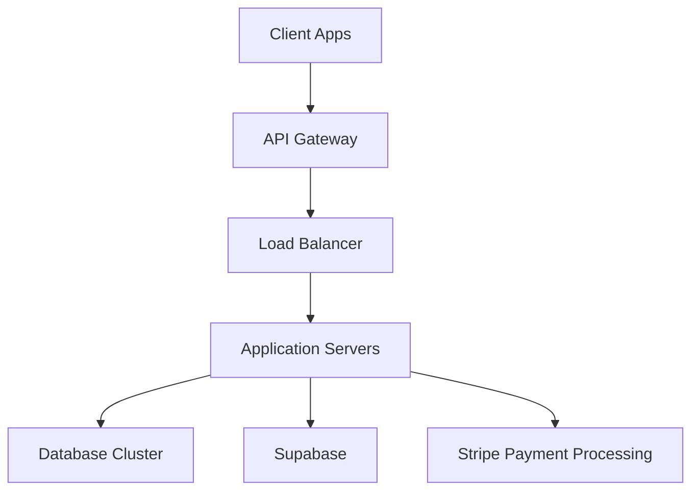

# RiggerHireApp Enterprise Deployment Guide

This guide outlines the enterprise deployment process for RiggerHireApp, a B2B SaaS platform for the Western Australian construction and mining industry.

## Architecture Overview



## Prerequisites

- Node.js (Latest LTS)
- TypeScript
- Docker & Docker Compose
- AWS Account with appropriate IAM roles
- Supabase Account
- Stripe Account
- SSL Certificates

## Deployment Environments

1. Development
2. Staging
3. Production

## Security Requirements

- HTTPS enforcement
- WAF (Web Application Firewall)
- DDoS protection
- Regular security audits
- Compliance with AU data protection standards
- Industry-standard encryption at rest and in transit

## CI/CD Pipeline

1. Code Push
2. Automated Tests
   - Unit Tests
   - Integration Tests
   - E2E Tests
   - Security Scans
3. Build Process
4. Staging Deployment
5. Production Deployment

## Deployment Steps

### 1. Infrastructure Setup

```bash
# Initialize infrastructure as code
terraform init
terraform plan
terraform apply
```

### 2. Database Migration

```bash
# Run database migrations
npm run migrate:prod
```

### 3. Application Deployment

```bash
# Build application
npm run build

# Deploy to production
npm run deploy:prod
```

### 4. Configuration

- Environment Variables
- API Keys
- Database Credentials
- Payment Processing Setup

### 5. Monitoring Setup

- Application Monitoring
- Error Tracking
- Performance Metrics
- User Analytics

## Scaling Considerations

- Horizontal scaling for application servers
- Database replication
- Cache implementation
- CDN configuration

## Backup and Recovery

- Daily automated backups
- Point-in-time recovery
- Disaster recovery plan
- Backup testing schedule

## Health Checks

- API endpoints
- Database connections
- Third-party service integration
- SSL certificate monitoring

## Compliance and Standards

- WCAG 2.1 Level AA compliance
- Australian Privacy Principles (APP)
- WA Work Health and Safety regulations
- Industry security standards

## Rollback Procedures

1. Identify deployment issues
2. Execute rollback command
3. Verify system stability
4. Root cause analysis

## Contact Information

For deployment support:
- DevOps Team: devops@your-domain.com
- Security Team: security@your-domain.com
- Emergency Contact: emergency@your-domain.com

## Maintenance Windows

- Scheduled maintenance: Sundays 02:00-04:00 AWST
- Emergency maintenance: As required with minimum 2-hour notice

## Performance Requirements

- API Response Time: < 200ms
- Availability: 99.9%
- Maximum concurrent users: 10,000+

## Load Testing

```bash
# Run load tests
npm run test:load

# Generate performance report
npm run report:performance
```

## Security Scanning

```bash
# Run security scan
npm run security:scan

# Generate security report
npm run report:security
```

## Troubleshooting

Common issues and their solutions:
1. Database connection issues
2. Payment processing errors
3. API gateway timeouts
4. Load balancer health check failures

## Version Control

- Git branching strategy
- Release tagging
- Changelog maintenance
- Version numbering scheme

## Documentation

- API documentation
- System architecture
- Database schema
- Network topology

Remember to update this guide as the system evolves and new requirements emerge.
