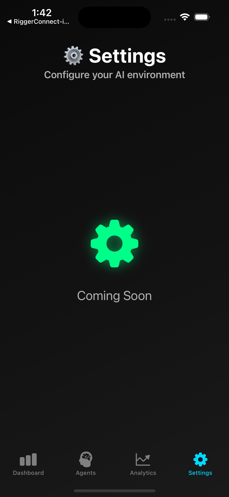
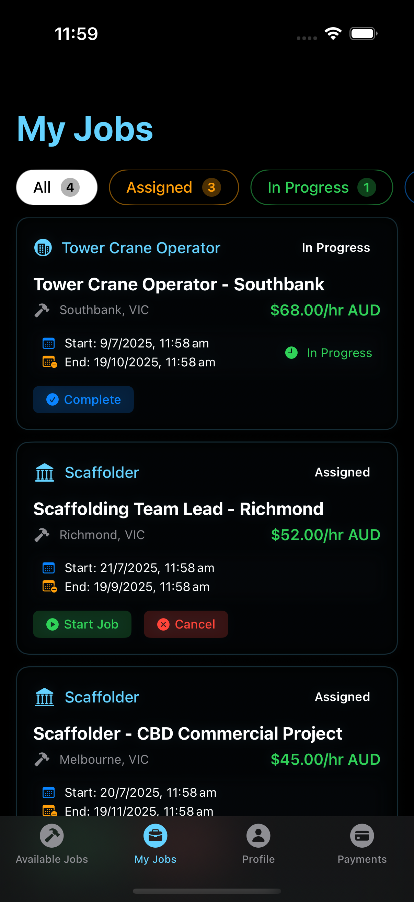
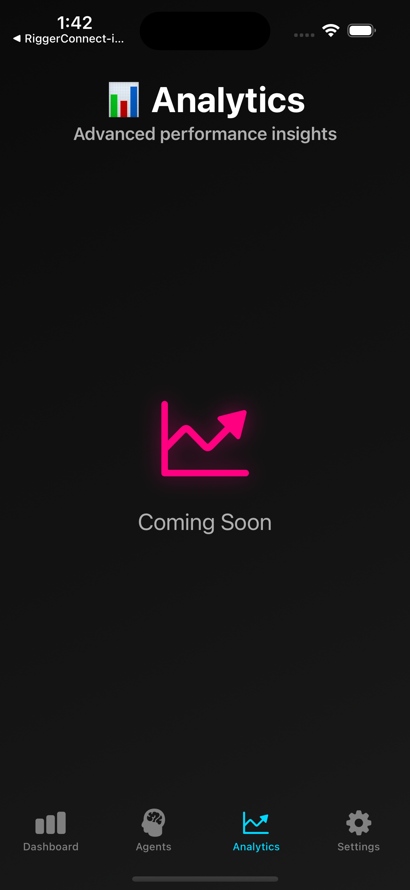
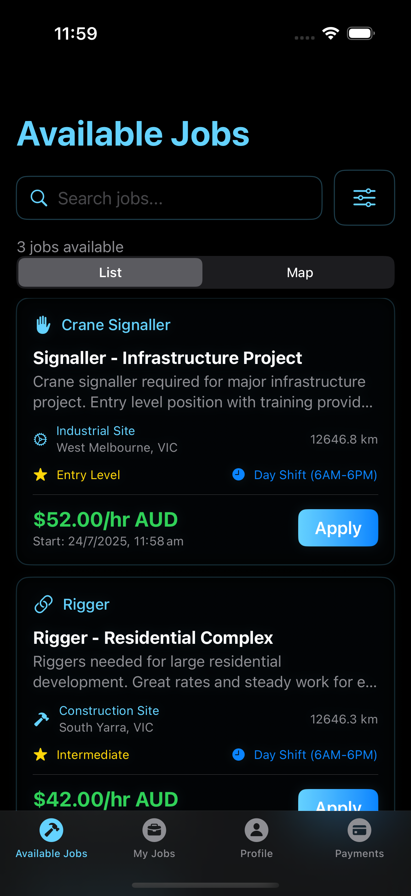
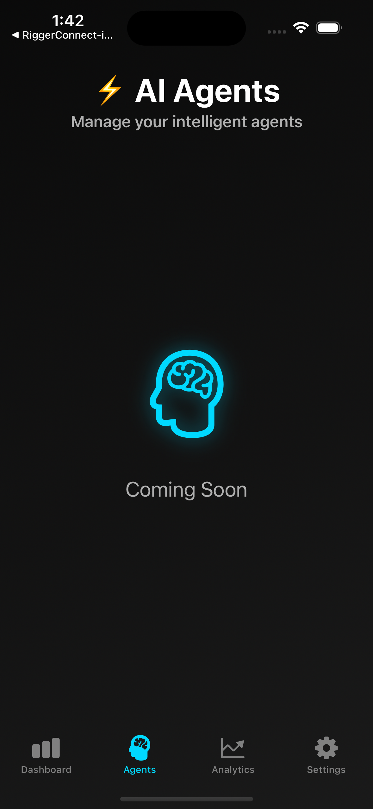

# RiggerHireApp

Enterprise-grade recruitment platform for the Western Australian construction and mining industries.


## 🏗️ Overview

RiggerHireApp is an enterprise-grade B2B platform revolutionizing recruitment in Western Australia's construction and mining industries. Our platform seamlessly connects businesses with certified riggers, doggers, and crane operators while ensuring strict compliance with WorkSafe WA standards.

## 🎯 Key Benefits

- **Safety First**: Automated WorkSafe WA compliance verification
- **Efficiency**: AI-powered matching system
- **Reliability**: Real-time worker availability tracking
- **Security**: Enterprise-grade data protection
- **Compliance**: Automated certification verification
- **Accessibility**: WCAG 2.1 compliant interface

## 🚀 Features

### Core Capabilities
- Enterprise-grade safety compliance system
- AI-powered worker-job matching
- Real-time availability tracking
- Secure payment processing (Stripe & Supabase)
- Mobile-first responsive design
- Automated certification verification

### Business Features
- Comprehensive worker verification
- Automated compliance checking
- Real-time availability updates
- Secure payment processing
- Analytics dashboard
- Automated reporting

### Worker Features
- Digital certification management
- Real-time job notifications
- Secure document storage
- Payment tracking
- Professional profile builder
- Skills verification

## 🏢 Repository Structure

```
RiggerHireApp/
├── android/           # Android mobile app
├── ios/              # iOS mobile app
├── B2B-web/          # Business client web interface
├── Staff-web/        # Staff management portal
├── backend/          # Core backend services
├── services/         # Microservices
├── docs/             # Documentation
├── testing/          # Test suites
└── infrastructure/   # DevOps and deployment
```

## 🛠️ Tech Stack

- Mobile: Swift (iOS), Kotlin (Android)
- Web: TypeScript, React
- Backend: Node.js, TypeScript
- Database: PostgreSQL, Redis
- Infrastructure: Docker, Kubernetes
- Payment Processing: Stripe, Supabase

## 📱 Screenshots

### Mobile-Responsive Design

Our enterprise-grade platform features a dark neon theme with cyan/magenta gradients, optimized for all screen sizes:

#### Business Dashboard




#### Worker Profile




#### Job Listings



## 🔧 Development Setup

[Documentation in Progress]

## 📄 Documentation

- [API Documentation](./docs/api/README.md)
- [Architecture Overview](./docs/architecture/README.md)
- [Deployment Guide](./docs/deployment/README.md)

## 🤝 Contributing

[Guidelines in Progress]
