# RiggerHireApp Microservices Architecture

## Overview
Enterprise-grade microservices architecture for the RiggerHireApp platform, designed specifically for the Western Australia construction and mining industries.

```mermaid
graph TD
    Client[Client Apps]
    API[API Gateway]
    Auth[Authentication Service]
    Doc[Document Processing Service]
    Notif[Notification Service]
    Analytics[Analytics Service]
    DB[(Database)]
    Cache[(Redis Cache)]
    
    Client --> API
    API --> Auth
    API --> Doc
    API --> Notif
    API --> Analytics
    
    Auth --> DB
    Auth --> Cache
    Doc --> DB
    Notif --> DB
    Analytics --> DB
    
    style Client fill:#2E2E2E,stroke:#00FFFF,stroke-width:2px
    style API fill:#2E2E2E,stroke:#FF00FF,stroke-width:2px
    style Auth fill:#2E2E2E,stroke:#00FFFF,stroke-width:2px
    style Doc fill:#2E2E2E,stroke:#FF00FF,stroke-width:2px
    style Notif fill:#2E2E2E,stroke:#00FFFF,stroke-width:2px
    style Analytics fill:#2E2E2E,stroke:#FF00FF,stroke-width:2px
    style DB fill:#2E2E2E,stroke:#00FFFF,stroke-width:2px
    style Cache fill:#2E2E2E,stroke:#FF00FF,stroke-width:2px
```

## Services Description

### Authentication Service
- OAuth2/JWT implementation
- Role-based access control (RBAC)
- Integration with Western Australia safety standards verification
- Token management and blacklisting
- Multi-factor authentication support

### Document Processing Service
- License and certification validation
- WorkSafe WA compliance checking
- Automated document verification
- Secure document storage and retrieval
- Version control for documents

### Notification Service
- Real-time event notifications
- Multi-channel support (Email, SMS, Push)
- Template management
- Delivery status tracking
- Rate limiting and throttling

### Analytics Service
- Industry compliance reporting
- Safety metrics tracking
- Hiring trends analysis
- Custom report generation
- Real-time analytics dashboard

## Technology Stack

- **API Gateway**: Node.js/Express
- **Services**: Node.js/TypeScript
- **Database**: PostgreSQL with Supabase
- **Cache**: Redis
- **Message Queue**: RabbitMQ
- **Container Orchestration**: Docker/Kubernetes
- **Payment Processing**: Stripe

## Security Measures

- End-to-end encryption
- Regular security audits
- Compliance with Australian data protection standards
- Rate limiting and DDoS protection
- Regular penetration testing

## Deployment Strategy

- Blue-Green deployment
- Automated CI/CD pipeline
- Monitoring and alerting
- Automatic scaling
- Disaster recovery plan

## Performance Considerations

- Caching strategy
- Load balancing
- Database optimization
- CDN integration
- API rate limiting
