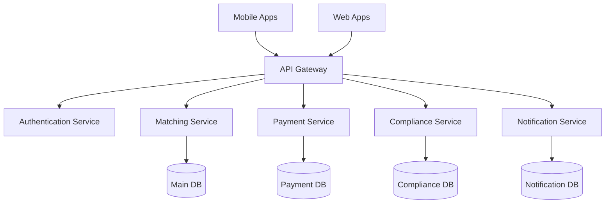

# RiggerHireApp Architecture

## System Overview

RiggerHireApp is built as a microservices-based architecture with the following key components:

### Core Components

### Key Services

1. **Authentication Service**
   - User management
   - Role-based access control
   - JWT token handling

2. **Matching Service**
   - Worker availability tracking
   - Job matching algorithm
   - Real-time updates

3. **Payment Service**
   - Stripe integration
   - Payment processing
   - Invoice generation

4. **Compliance Service**
   - Certification verification
   - Safety compliance checks
   - Document management

## Tech Stack Details

### Mobile Applications
- iOS: Swift/UIKit
- Android: Kotlin/Jetpack Compose

### Web Applications
- Framework: React with TypeScript
- State Management: Redux
- UI Components: Custom themed components

### Backend Services
- Runtime: Node.js
- Language: TypeScript
- API: GraphQL/REST
- Database: PostgreSQL
- Cache: Redis

### Infrastructure
- Containerization: Docker
- Orchestration: Kubernetes
- CI/CD: GitHub Actions
- Monitoring: Prometheus/Grafana

## Security Architecture

- End-to-end encryption for sensitive data
- Role-based access control
- Regular security audits
- Compliance with Australian data protection standards

## Deployment Architecture

[Deployment diagram to be added]

## Data Flow

[Data flow diagram to be added]

## Future Considerations

1. Scalability improvements
2. AI/ML integration for better matching
3. Blockchain for certification verification
4. Enhanced mobile features
