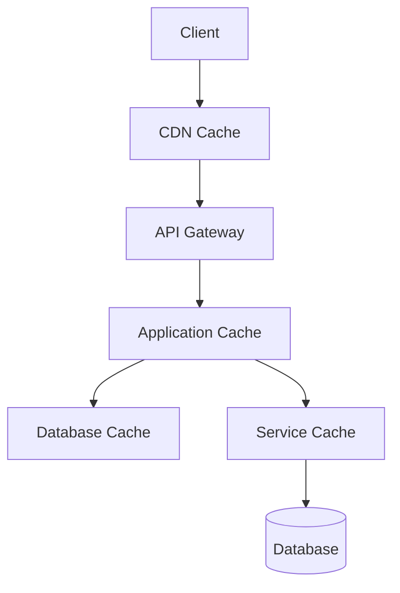

# Caching Strategy

## Overview

The RiggerHireApp implements a multi-level caching strategy to optimize performance, reduce database load, and enhance user experience across all services.



## Cache Layers

### 1. CDN Caching
- Static assets (images, CSS, JS)
- API responses for public data
- Cache TTL: 24 hours
- Cache invalidation via versioned URLs

### 2. Application Cache (Redis)
```typescript
interface CacheConfig {
  key: string;
  ttl: number;
  namespace: string;
  strategy: 'write-through' | 'write-behind' | 'cache-aside';
}

// Example implementation
class ApplicationCache {
  async get<T>(key: string): Promise<T | null>;
  async set<T>(key: string, value: T, ttl?: number): Promise<void>;
  async invalidate(key: string): Promise<void>;
  async invalidatePattern(pattern: string): Promise<void>;
}
```

### 3. Service-Level Cache

#### Job Matching Service
```typescript
// Cache configuration
const jobMatchingCache: CacheConfig = {
  namespace: 'job-matching',
  strategy: 'write-through',
  patterns: {
    searchResults: 'search:*',
    jobDetails: 'job:*',
    workerProfile: 'worker:*'
  },
  ttl: {
    searchResults: 300, // 5 minutes
    jobDetails: 1800,   // 30 minutes
    workerProfile: 3600 // 1 hour
  }
};
```

#### Authentication Service
```typescript
// Token cache configuration
const authCache: CacheConfig = {
  namespace: 'auth',
  strategy: 'write-through',
  patterns: {
    accessToken: 'token:access:*',
    refreshToken: 'token:refresh:*',
    userSession: 'session:*'
  },
  ttl: {
    accessToken: 900,    // 15 minutes
    refreshToken: 604800 // 7 days
    userSession: 3600    // 1 hour
  }
};
```

## Caching Strategies

### 1. Write-Through Cache
- Used for: User profiles, Job details
- Implementation:
```typescript
async function writeThrough<T>(key: string, data: T): Promise<void> {
  await Promise.all([
    database.save(key, data),
    cache.set(key, data)
  ]);
}
```

### 2. Write-Behind Cache
- Used for: Analytics data, Log entries
- Implementation:
```typescript
async function writeBehind<T>(key: string, data: T): Promise<void> {
  await cache.set(key, data);
  await messageQueue.publish('cache-flush', { key, data });
}
```

### 3. Cache-Aside
- Used for: Search results, Aggregated data
- Implementation:
```typescript
async function cacheAside<T>(key: string, fetchFn: () => Promise<T>): Promise<T> {
  const cached = await cache.get<T>(key);
  if (cached) return cached;
  
  const data = await fetchFn();
  await cache.set(key, data);
  return data;
}
```

## Cache Invalidation

### 1. Time-Based Invalidation
- Default strategy for most cached items
- Configurable TTL based on data type
- Automatic expiration handling

### 2. Event-Based Invalidation
```typescript
// Example: Job update trigger
async function handleJobUpdate(jobId: string): Promise<void> {
  await Promise.all([
    cache.invalidate(`job:${jobId}`),
    cache.invalidatePattern(`search:*`),
    cache.invalidatePattern(`worker:*:matches`)
  ]);
}
```

### 3. Version-Based Invalidation
- Used for static assets and API responses
- Implementation via cache busting
- Version tracking in metadata

## Monitoring and Metrics

### 1. Performance Metrics
- Cache hit ratio
- Cache miss rate
- Average response time
- Memory usage

### 2. Health Checks
```typescript
interface CacheHealth {
  status: 'healthy' | 'degraded' | 'unhealthy';
  metrics: {
    hitRate: number;
    missRate: number;
    evictionRate: number;
    memoryUsage: number;
  };
}
```

## Error Handling

### 1. Cache Failures
```typescript
async function resilientCacheGet<T>(key: string): Promise<T | null> {
  try {
    return await cache.get<T>(key);
  } catch (error) {
    metrics.increment('cache.error');
    logger.error('Cache get failed', { key, error });
    return null;
  }
}
```

### 2. Fallback Strategy
- Circuit breaker pattern
- Gradual degradation
- Database fallback

## Security Considerations

1. **Data Protection**
   - Encryption at rest
   - Secure key generation
   - PII handling compliance

2. **Access Control**
   - Cache access authentication
   - Rate limiting
   - Audit logging

3. **Network Security**
   - VPC configuration
   - Firewall rules
   - SSL/TLS encryption
