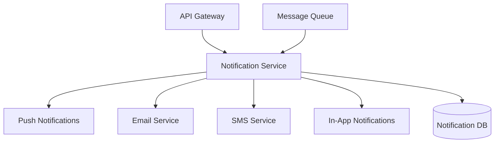

# Notification Service Architecture

## Overview

The Notification Service is a dedicated microservice responsible for handling all types of notifications across the RiggerHireApp ecosystem, ensuring reliable and scalable message delivery to all stakeholders.



## Core Features

1. **Multi-Channel Support**
   - Push notifications (iOS/Android)
   - Email notifications
   - SMS alerts
   - In-app notifications
   - WhatsApp Business API integration

2. **Priority-based Delivery**
   - Critical alerts (Immediate delivery)
   - Standard notifications (Batched delivery)
   - Marketing communications (Scheduled delivery)

3. **Template Management**
   - Customizable templates
   - Localization support
   - Dynamic content insertion
   - Rich media support

## Technical Implementation

### Message Queue Integration
```typescript
interface NotificationMessage {
  type: 'PUSH' | 'EMAIL' | 'SMS' | 'IN_APP' | 'WHATSAPP';
  priority: 'HIGH' | 'MEDIUM' | 'LOW';
  template: string;
  recipients: string[];
  data: Record<string, unknown>;
  metadata: {
    jobId?: string;
    companyId?: string;
    triggeredBy?: string;
  };
}
```

### Delivery Providers
- Push: Firebase Cloud Messaging (FCM)
- Email: AWS SES
- SMS: Twilio
- WhatsApp: WhatsApp Business API

### Rate Limiting
- High priority: 100 requests/second
- Medium priority: 50 requests/second
- Low priority: 10 requests/second

## Use Cases

1. **Job Matching Notifications**
```typescript
// Example notification trigger
await notificationService.send({
  type: 'PUSH',
  priority: 'HIGH',
  template: 'JOB_MATCH',
  recipients: ['worker-id'],
  data: {
    jobId: 'job-123',
    companyName: 'ABC Construction',
    location: 'Perth, WA'
  }
});
```

2. **Compliance Alerts**
```typescript
// Example compliance notification
await notificationService.send({
  type: 'EMAIL',
  priority: 'HIGH',
  template: 'CERTIFICATION_EXPIRY',
  recipients: ['worker@email.com'],
  data: {
    certificationType: 'Rigging License',
    expiryDate: '2025-08-19'
  }
});
```

## Error Handling

1. **Retry Strategy**
   - Immediate retry for high priority
   - Exponential backoff for medium/low priority
   - Maximum 3 retries for all priorities

2. **Dead Letter Queue**
   - Failed notifications after retries
   - Manual review system
   - Automated cleanup after 30 days

## Monitoring

1. **Key Metrics**
   - Delivery success rate
   - Average delivery time
   - Queue length
   - Error rates by channel

2. **Alerting**
   - Queue backup alerts
   - High error rate alerts
   - Provider availability alerts

## Security

1. **Data Protection**
   - End-to-end encryption for sensitive data
   - PII handling compliance
   - Australian data protection standards

2. **Access Control**
   - Service-level authentication
   - Template access restrictions
   - Audit logging
