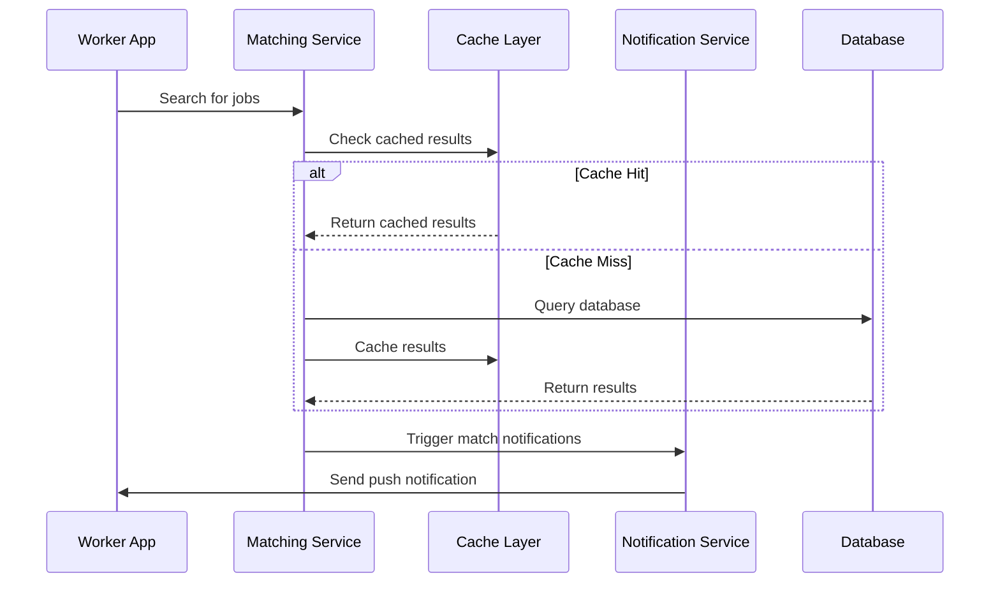
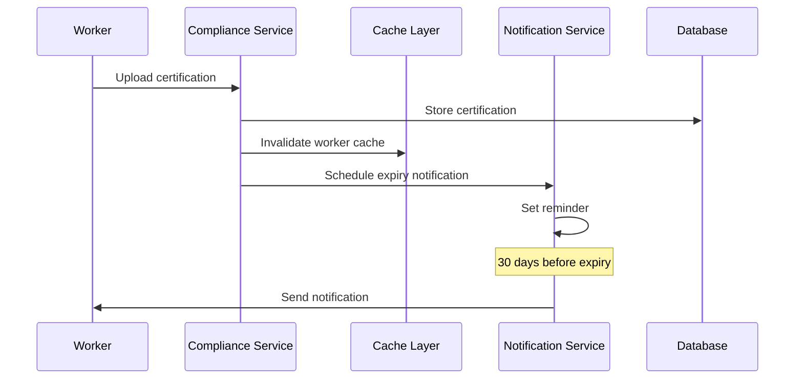
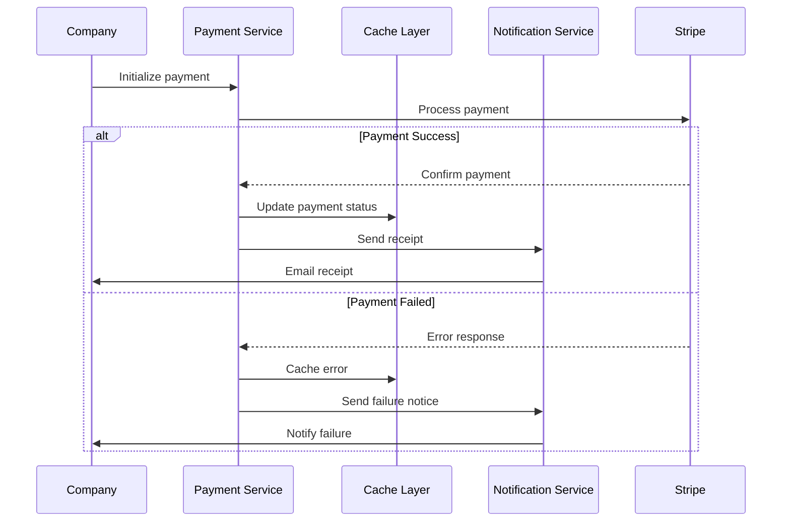
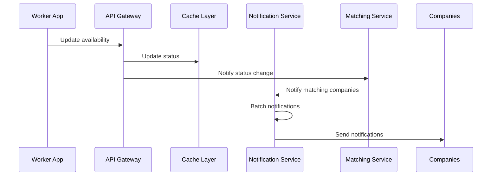

# Service Integration Examples

## Overview

This document demonstrates how the Notification Service and Caching Strategy integrate with existing RiggerHireApp services through practical examples.

## 1. Job Matching Flow



### Implementation Example

```typescript
// Job Matching Service Integration
class JobMatchingService {
  constructor(
    private cache: ApplicationCache,
    private notificationService: NotificationService,
    private db: Database
  ) {}

  async findMatches(workerId: string): Promise<JobMatch[]> {
    // Cache implementation
    const cacheKey = `worker:${workerId}:matches`;
    const cached = await this.cache.get<JobMatch[]>(cacheKey);
    
    if (cached) {
      return cached;
    }

    // Database query if cache miss
    const matches = await this.db.query(
      'SELECT * FROM job_matches WHERE worker_id = $1',
      [workerId]
    );

    // Cache the results
    await this.cache.set(cacheKey, matches, 300); // 5 minutes TTL

    // Send notifications for new matches
    await this.notifyNewMatches(workerId, matches);
    
    return matches;
  }

  private async notifyNewMatches(workerId: string, matches: JobMatch[]): Promise<void> {
    const newMatches = matches.filter(match => match.isNew);
    
    if (newMatches.length > 0) {
      await this.notificationService.send({
        type: 'PUSH',
        priority: 'HIGH',
        template: 'NEW_JOB_MATCHES',
        recipients: [workerId],
        data: {
          matchCount: newMatches.length,
          topMatch: {
            companyName: newMatches[0].company.name,
            location: newMatches[0].location,
            wage: newMatches[0].hourlyRate
          }
        }
      });
    }
  }
}
```

## 2. Compliance Certification Flow



### Implementation Example

```typescript
// Compliance Service Integration
class ComplianceService {
  constructor(
    private cache: ApplicationCache,
    private notificationService: NotificationService,
    private db: Database
  ) {}

  async uploadCertification(
    workerId: string,
    certification: CertificationDocument
  ): Promise<void> {
    // Store certification
    await this.db.transaction(async (trx) => {
      await trx.certifications.insert(certification);
      
      // Invalidate relevant caches
      await this.cache.invalidatePattern(`worker:${workerId}:*`);
      
      // Schedule expiry notifications
      const expiryDate = new Date(certification.expiryDate);
      const notifyDate = new Date(expiryDate);
      notifyDate.setDate(notifyDate.getDate() - 30); // 30 days before expiry
      
      await this.notificationService.schedule({
        type: 'EMAIL',
        priority: 'HIGH',
        template: 'CERTIFICATION_EXPIRY',
        scheduledDate: notifyDate,
        recipients: [workerId],
        data: {
          certificationType: certification.type,
          expiryDate: certification.expiryDate,
          renewalUrl: `https://app.riggerhire.com/certifications/renew/${certification.id}`
        }
      });
    });
  }

  async verifyCertification(workerId: string, certType: string): Promise<boolean> {
    const cacheKey = `certification:${workerId}:${certType}`;
    
    // Try cache first
    const cached = await this.cache.get<CertificationStatus>(cacheKey);
    if (cached) {
      return cached.isValid;
    }

    // Database check if cache miss
    const certification = await this.db.certifications.findLatest(
      workerId,
      certType
    );

    const status = {
      isValid: this.validateCertification(certification),
      checkedAt: new Date()
    };

    // Cache the result
    await this.cache.set(cacheKey, status, 3600); // 1 hour TTL
    
    return status.isValid;
  }
}
```

## 3. Payment Processing Flow



### Implementation Example

```typescript
// Payment Service Integration
class PaymentService {
  constructor(
    private cache: ApplicationCache,
    private notificationService: NotificationService,
    private stripe: Stripe
  ) {}

  async processPayment(
    companyId: string,
    payment: PaymentDetails
  ): Promise<PaymentResult> {
    try {
      // Process payment with Stripe
      const stripeResult = await this.stripe.charges.create({
        amount: payment.amount,
        currency: 'aud',
        customer: payment.stripeCustomerId,
        description: payment.description
      });

      // Cache the payment result
      const cacheKey = `payment:${payment.id}`;
      await this.cache.set(cacheKey, {
        status: 'completed',
        transactionId: stripeResult.id
      }, 86400); // 24 hours TTL

      // Send success notification
      await this.notificationService.send({
        type: 'EMAIL',
        priority: 'HIGH',
        template: 'PAYMENT_RECEIPT',
        recipients: [payment.companyEmail],
        data: {
          amount: payment.amount,
          date: new Date(),
          invoiceUrl: `https://app.riggerhire.com/invoices/${payment.id}`,
          transactionId: stripeResult.id
        }
      });

      return {
        success: true,
        transactionId: stripeResult.id
      };

    } catch (error) {
      // Cache the error for monitoring
      const errorCacheKey = `payment:error:${payment.id}`;
      await this.cache.set(errorCacheKey, {
        error: error.message,
        timestamp: new Date()
      }, 3600); // 1 hour TTL

      // Send failure notification
      await this.notificationService.send({
        type: 'EMAIL',
        priority: 'HIGH',
        template: 'PAYMENT_FAILED',
        recipients: [payment.companyEmail],
        data: {
          amount: payment.amount,
          date: new Date(),
          reason: error.message,
          supportUrl: 'https://app.riggerhire.com/support'
        }
      });

      return {
        success: false,
        error: error.message
      };
    }
  }
}
```

## 4. Real-time Worker Availability Update



### Implementation Example

```typescript
// Worker Availability Service Integration
class WorkerAvailabilityService {
  constructor(
    private cache: ApplicationCache,
    private notificationService: NotificationService,
    private matchingService: MatchingService
  ) {}

  async updateAvailability(
    workerId: string,
    availability: WorkerAvailability
  ): Promise<void> {
    // Update cache first for immediate availability
    const cacheKey = `worker:${workerId}:availability`;
    await this.cache.set(cacheKey, availability, 3600); // 1 hour TTL

    // Find matching companies
    const matches = await this.matchingService.findMatchingCompanies(
      workerId,
      availability
    );

    // Group notifications by company
    const notifications = matches.map(match => ({
      type: 'PUSH',
      priority: 'MEDIUM',
      template: 'WORKER_AVAILABLE',
      recipients: [match.companyId],
      data: {
        workerProfile: match.workerProfile,
        availability: availability,
        matchScore: match.score
      }
    }));

    // Batch send notifications
    await this.notificationService.sendBatch(notifications);
  }

  async getWorkerAvailability(workerId: string): Promise<WorkerAvailability> {
    const cacheKey = `worker:${workerId}:availability`;
    
    // Try cache first
    const cached = await this.cache.get<WorkerAvailability>(cacheKey);
    if (cached) {
      return cached;
    }

    // Fallback to database if cache miss
    const availability = await this.db.workers.getAvailability(workerId);
    
    // Cache the result
    await this.cache.set(cacheKey, availability, 3600); // 1 hour TTL
    
    return availability;
  }
}
```

## Error Handling and Resilience

Each integration implements:
- Circuit breaker pattern for external services
- Retry mechanisms for transient failures
- Fallback strategies when services are degraded
- Comprehensive error logging and monitoring

## Monitoring and Metrics

Key metrics tracked for each integration:
- Response times
- Error rates
- Cache hit/miss ratios
- Notification delivery success rates
- Service health status

## Security Considerations

- All service-to-service communication is authenticated
- Sensitive data is encrypted in transit and at rest
- Rate limiting is applied to prevent abuse
- Audit logging for all critical operations
