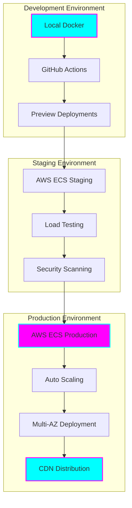

# 🚀 Tiation SaaS Ecosystem - Deployment Strategy

<div align="center">


**Multi-Platform SaaS Deployment with Enterprise-Grade Infrastructure**

*☁️ Cloud-Native • 🐳 Containerized • 🔄 CI/CD Automated • 🛡️ Enterprise Security*

</div>

## 🎯 Executive Summary

This document outlines the comprehensive deployment strategy for the **Tiation SaaS Ecosystem**, covering all monetization platforms with enterprise-grade infrastructure, security, and scalability. Our multi-environment approach ensures seamless deployment from development to production with automated CI/CD pipelines.

### 🏗️ Deployment Architecture Overview



---

## 🌍 Multi-Environment Strategy

### 1. **Development Environment**
- **Local Docker Compose** for rapid development
- **Hot reloading** for backend and frontend
- **Stripe Test Mode** for payment testing
- **Local databases** (PostgreSQL, Redis, MongoDB)

### 2. **Staging Environment**
- **AWS ECS** with staging cluster
- **RDS staging instances** for databases
- **Stripe Test Mode** with webhook testing
- **Performance testing** and load testing

### 3. **Production Environment**
- **AWS ECS** with production cluster
- **Multi-AZ RDS** for high availability
- **Stripe Live Mode** with production webhooks
- **CloudFront CDN** for global distribution
- **Auto-scaling** based on demand

---

## 🐳 Platform-Specific Deployment Configurations

### 1. 🏗️ Rigger Platform Deployment

#### Production Docker Compose
```yaml
version: '3.8'
services:
  rigger-backend:
    image: tiation/rigger-backend:latest
    environment:
      NODE_ENV: production
      DATABASE_URL: ${DATABASE_URL}
      STRIPE_SECRET_KEY: ${STRIPE_SECRET_KEY}
      STRIPE_WEBHOOK_SECRET: ${STRIPE_WEBHOOK_SECRET}
    deploy:
      replicas: 3
      resources:
        limits:
          memory: 1G
          cpus: '0.5'
```

#### Kubernetes Configuration
```yaml
apiVersion: apps/v1
kind: Deployment
metadata:
  name: rigger-backend
spec:
  replicas: 3
  selector:
    matchLabels:
      app: rigger-backend
  template:
    spec:
      containers:
      - name: rigger-backend
        image: tiation/rigger-backend:latest
        resources:
          requests:
            memory: "512Mi"
            cpu: "250m"
          limits:
            memory: "1Gi"
            cpu: "500m"
```

### 2. 🤖 AI Agents Platform Deployment

#### ECS Task Definition
```json
{
  "family": "ai-agents-backend",
  "taskRoleArn": "arn:aws:iam::account:role/ecsTaskRole",
  "executionRoleArn": "arn:aws:iam::account:role/ecsTaskExecutionRole",
  "networkMode": "awsvpc",
  "requiresCompatibilities": ["FARGATE"],
  "cpu": "512",
  "memory": "1024",
  "containerDefinitions": [
    {
      "name": "ai-agents-backend",
      "image": "tiation/ai-agents-backend:latest",
      "essential": true,
      "portMappings": [
        {
          "containerPort": 3000,
          "protocol": "tcp"
        }
      ],
      "environment": [
        {
          "name": "NODE_ENV",
          "value": "production"
        }
      ],
      "secrets": [
        {
          "name": "STRIPE_SECRET_KEY",
          "valueFrom": "arn:aws:secretsmanager:region:account:secret:stripe-secret"
        }
      ]
    }
  ]
}
```

### 3. 🎲 Gaming Platform Deployment

#### Serverless Configuration (AWS Lambda)
```yaml
service: dnd-gaming-saas
provider:
  name: aws
  runtime: nodejs18.x
  region: ap-southeast-2
  environment:
    STRIPE_SECRET_KEY: ${ssm:/gaming/stripe/secret}
    MONGODB_URI: ${ssm:/gaming/mongodb/uri}

functions:
  gamingApi:
    handler: src/handler.main
    events:
      - http:
          path: /{proxy+}
          method: ANY
          cors: true
    vpc:
      securityGroupIds:
        - sg-gaming-lambda
      subnetIds:
        - subnet-private-1
        - subnet-private-2
```

---

## ☁️ AWS Infrastructure Configuration

### 1. **ECS Cluster Setup**

```bash
# Create ECS cluster
aws ecs create-cluster \
  --cluster-name tiation-saas-production \
  --capacity-providers FARGATE \
  --default-capacity-provider-strategy capacityProvider=FARGATE,weight=1

# Create task definition
aws ecs register-task-definition \
  --cli-input-json file://task-definition.json

# Create service
aws ecs create-service \
  --cluster tiation-saas-production \
  --service-name rigger-backend-service \
  --task-definition rigger-backend:1 \
  --desired-count 3 \
  --launch-type FARGATE \
  --network-configuration "awsvpcConfiguration={subnets=[subnet-12345,subnet-67890],securityGroups=[sg-12345],assignPublicIp=ENABLED}"
```

### 2. **RDS Database Setup**

```bash
# Create RDS subnet group
aws rds create-db-subnet-group \
  --db-subnet-group-name tiation-saas-subnet-group \
  --db-subnet-group-description "Tiation SaaS Database Subnet Group" \
  --subnet-ids subnet-12345 subnet-67890

# Create RDS instance
aws rds create-db-instance \
  --db-instance-identifier tiation-saas-production \
  --db-instance-class db.t3.medium \
  --engine postgres \
  --engine-version 14.9 \
  --allocated-storage 100 \
  --storage-type gp2 \
  --storage-encrypted \
  --db-name tiation_saas \
  --master-username postgres \
  --master-user-password "${DB_PASSWORD}" \
  --db-subnet-group-name tiation-saas-subnet-group \
  --vpc-security-group-ids sg-database \
  --backup-retention-period 7 \
  --multi-az \
  --deletion-protection
```

### 3. **Application Load Balancer**

```bash
# Create ALB
aws elbv2 create-load-balancer \
  --name tiation-saas-alb \
  --subnets subnet-12345 subnet-67890 \
  --security-groups sg-alb \
  --scheme internet-facing \
  --type application

# Create target group
aws elbv2 create-target-group \
  --name tiation-saas-targets \
  --protocol HTTP \
  --port 3000 \
  --vpc-id vpc-12345 \
  --target-type ip \
  --health-check-path /health
```

---

## 🔄 CI/CD Pipeline Configuration

### 1. **GitHub Actions Workflow**

```yaml
name: Tiation SaaS Multi-Platform Deployment

on:
  push:
    branches: [main, develop]
  pull_request:
    branches: [main]

env:
  AWS_REGION: ap-southeast-2
  ECR_REGISTRY: 123456789012.dkr.ecr.ap-southeast-2.amazonaws.com

jobs:
  # Multi-platform testing
  test-platforms:
    strategy:
      matrix:
        platform: [rigger, ai-agents, gaming, podcast, templates, enterprise]
    runs-on: ubuntu-latest
    steps:
      - uses: actions/checkout@v3
      
      - name: Setup Node.js
        uses: actions/setup-node@v3
        with:
          node-version: '18'
          
      - name: Test ${{ matrix.platform }} platform
        run: |
          cd ${{ matrix.platform }}
          npm ci
          npm run test:coverage
          
      - name: Security scan
        uses: aquasecurity/trivy-action@master
        with:
          scan-type: 'fs'
          scan-ref: '${{ matrix.platform }}'

  # Build and push Docker images
  build-images:
    needs: test-platforms
    runs-on: ubuntu-latest
    strategy:
      matrix:
        platform: [rigger, ai-agents, gaming, podcast, templates, enterprise]
    steps:
      - uses: actions/checkout@v3
      
      - name: Configure AWS credentials
        uses: aws-actions/configure-aws-credentials@v2
        with:
          aws-access-key-id: ${{ secrets.AWS_ACCESS_KEY_ID }}
          aws-secret-access-key: ${{ secrets.AWS_SECRET_ACCESS_KEY }}
          aws-region: ${{ env.AWS_REGION }}
          
      - name: Login to ECR
        id: login-ecr
        uses: aws-actions/amazon-ecr-login@v1
        
      - name: Build and push ${{ matrix.platform }} image
        env:
          ECR_REPOSITORY: tiation-${{ matrix.platform }}-backend
          IMAGE_TAG: ${{ github.sha }}
        run: |
          cd ${{ matrix.platform }}/backend
          docker build -t $ECR_REGISTRY/$ECR_REPOSITORY:$IMAGE_TAG .
          docker push $ECR_REGISTRY/$ECR_REPOSITORY:$IMAGE_TAG
          docker tag $ECR_REGISTRY/$ECR_REPOSITORY:$IMAGE_TAG $ECR_REGISTRY/$ECR_REPOSITORY:latest
          docker push $ECR_REGISTRY/$ECR_REPOSITORY:latest

  # Deploy to staging
  deploy-staging:
    needs: build-images
    runs-on: ubuntu-latest
    if: github.ref == 'refs/heads/develop'
    strategy:
      matrix:
        platform: [rigger, ai-agents, gaming, podcast, templates, enterprise]
    steps:
      - name: Deploy ${{ matrix.platform }} to staging
        run: |
          aws ecs update-service \
            --cluster tiation-saas-staging \
            --service ${{ matrix.platform }}-staging-service \
            --force-new-deployment

  # Deploy to production
  deploy-production:
    needs: build-images
    runs-on: ubuntu-latest
    if: github.ref == 'refs/heads/main'
    strategy:
      matrix:
        platform: [rigger, ai-agents, gaming, podcast, templates, enterprise]
    steps:
      - name: Deploy ${{ matrix.platform }} to production
        run: |
          aws ecs update-service \
            --cluster tiation-saas-production \
            --service ${{ matrix.platform }}-production-service \
            --force-new-deployment

  # Database migrations
  migrate-databases:
    needs: deploy-production
    runs-on: ubuntu-latest
    if: github.ref == 'refs/heads/main'
    steps:
      - uses: actions/checkout@v3
      
      - name: Run database migrations
        run: |
          for platform in rigger ai-agents gaming podcast templates enterprise; do
            cd $platform/backend
            npm ci
            npm run migrate
            cd ../..
          done
```

### 2. **Terraform Infrastructure as Code**

```hcl
# terraform/main.tf
provider "aws" {
  region = var.aws_region
}

# ECS Cluster
resource "aws_ecs_cluster" "tiation_saas" {
  name = "tiation-saas-${var.environment}"
  
  capacity_providers = ["FARGATE"]
  default_capacity_provider_strategy {
    capacity_provider = "FARGATE"
    weight           = 100
  }

  setting {
    name  = "containerInsights"
    value = "enabled"
  }

  tags = {
    Environment = var.environment
    Project     = "tiation-saas"
  }
}

# RDS Database
resource "aws_db_instance" "tiation_saas" {
  identifier = "tiation-saas-${var.environment}"
  
  engine         = "postgres"
  engine_version = "14.9"
  instance_class = var.db_instance_class
  
  allocated_storage     = var.db_allocated_storage
  max_allocated_storage = var.db_max_allocated_storage
  storage_encrypted     = true
  
  db_name  = "tiation_saas"
  username = var.db_username
  password = var.db_password
  
  vpc_security_group_ids = [aws_security_group.database.id]
  db_subnet_group_name   = aws_db_subnet_group.tiation_saas.name
  
  backup_retention_period = var.environment == "production" ? 7 : 1
  multi_az               = var.environment == "production" ? true : false
  deletion_protection    = var.environment == "production" ? true : false
  
  tags = {
    Environment = var.environment
    Project     = "tiation-saas"
  }
}

# Application Load Balancer
resource "aws_lb" "tiation_saas" {
  name               = "tiation-saas-${var.environment}"
  internal           = false
  load_balancer_type = "application"
  security_groups    = [aws_security_group.alb.id]
  subnets           = var.public_subnet_ids

  enable_deletion_protection = var.environment == "production" ? true : false

  tags = {
    Environment = var.environment
    Project     = "tiation-saas"
  }
}

# CloudFront Distribution
resource "aws_cloudfront_distribution" "tiation_saas" {
  count = var.environment == "production" ? 1 : 0
  
  origin {
    domain_name = aws_lb.tiation_saas.dns_name
    origin_id   = "tiation-saas-alb"
    
    custom_origin_config {
      http_port              = 80
      https_port             = 443
      origin_protocol_policy = "https-only"
      origin_ssl_protocols   = ["TLSv1.2"]
    }
  }

  enabled             = true
  is_ipv6_enabled     = true
  default_root_object = "index.html"

  aliases = var.domain_names

  default_cache_behavior {
    allowed_methods        = ["DELETE", "GET", "HEAD", "OPTIONS", "PATCH", "POST", "PUT"]
    cached_methods         = ["GET", "HEAD"]
    target_origin_id       = "tiation-saas-alb"
    compress               = true
    viewer_protocol_policy = "redirect-to-https"

    forwarded_values {
      query_string = true
      headers      = ["Host", "Authorization"]
      cookies {
        forward = "all"
      }
    }
  }

  price_class = "PriceClass_All"

  restrictions {
    geo_restriction {
      restriction_type = "none"
    }
  }

  viewer_certificate {
    acm_certificate_arn = var.ssl_certificate_arn
    ssl_support_method  = "sni-only"
  }

  tags = {
    Environment = var.environment
    Project     = "tiation-saas"
  }
}
```

---

## 🛡️ Security & Compliance

### 1. **Secrets Management**

```bash
# AWS Secrets Manager setup
aws secretsmanager create-secret \
  --name "tiation-saas/stripe/secret-key" \
  --description "Stripe secret key for Tiation SaaS" \
  --secret-string "${STRIPE_SECRET_KEY}"

aws secretsmanager create-secret \
  --name "tiation-saas/database/password" \
  --description "Database password for Tiation SaaS" \
  --secret-string "${DATABASE_PASSWORD}"

aws secretsmanager create-secret \
  --name "tiation-saas/jwt/secret" \
  --description "JWT secret for Tiation SaaS" \
  --secret-string "${JWT_SECRET}"
```

### 2. **IAM Roles and Policies**

```json
{
  "Version": "2012-10-17",
  "Statement": [
    {
      "Effect": "Allow",
      "Action": [
        "secretsmanager:GetSecretValue"
      ],
      "Resource": [
        "arn:aws:secretsmanager:*:*:secret:tiation-saas/*"
      ]
    },
    {
      "Effect": "Allow",
      "Action": [
        "rds:DescribeDBInstances",
        "rds:Connect"
      ],
      "Resource": "*"
    }
  ]
}
```

### 3. **Security Groups**

```hcl
# Web tier security group
resource "aws_security_group" "web" {
  name_prefix = "tiation-saas-web-"
  vpc_id      = var.vpc_id

  ingress {
    from_port   = 80
    to_port     = 80
    protocol    = "tcp"
    cidr_blocks = ["0.0.0.0/0"]
  }

  ingress {
    from_port   = 443
    to_port     = 443
    protocol    = "tcp"
    cidr_blocks = ["0.0.0.0/0"]
  }

  egress {
    from_port   = 0
    to_port     = 0
    protocol    = "-1"
    cidr_blocks = ["0.0.0.0/0"]
  }
}

# Application tier security group
resource "aws_security_group" "app" {
  name_prefix = "tiation-saas-app-"
  vpc_id      = var.vpc_id

  ingress {
    from_port       = 3000
    to_port         = 3000
    protocol        = "tcp"
    security_groups = [aws_security_group.web.id]
  }

  egress {
    from_port   = 0
    to_port     = 0
    protocol    = "-1"
    cidr_blocks = ["0.0.0.0/0"]
  }
}

# Database tier security group
resource "aws_security_group" "database" {
  name_prefix = "tiation-saas-db-"
  vpc_id      = var.vpc_id

  ingress {
    from_port       = 5432
    to_port         = 5432
    protocol        = "tcp"
    security_groups = [aws_security_group.app.id]
  }
}
```

---

## 📊 Monitoring & Observability

### 1. **CloudWatch Configuration**

```yaml
# cloudwatch-config.yml
version: 1
agent:
  metrics_collection_interval: 60
  run_as_user: cwagent
metrics:
  namespace: TiationSaaS
  metrics_collected:
    cpu:
      measurement:
        - cpu_usage_idle
        - cpu_usage_iowait
        - cpu_usage_user
        - cpu_usage_system
      metrics_collection_interval: 60
    disk:
      measurement:
        - used_percent
      metrics_collection_interval: 60
      resources:
        - "*"
    diskio:
      measurement:
        - io_time
      metrics_collection_interval: 60
      resources:
        - "*"
    mem:
      measurement:
        - mem_used_percent
      metrics_collection_interval: 60
    netstat:
      measurement:
        - tcp_established
        - tcp_time_wait
      metrics_collection_interval: 60
    swap:
      measurement:
        - swap_used_percent
      metrics_collection_interval: 60
logs:
  logs_collected:
    files:
      collect_list:
        - file_path: /var/log/application.log
          log_group_name: tiation-saas-application
          log_stream_name: "{instance_id}"
        - file_path: /var/log/stripe-webhooks.log
          log_group_name: tiation-saas-stripe
          log_stream_name: "{instance_id}"
```

### 2. **Prometheus Metrics**

```javascript
// metrics.js - Custom metrics for SaaS platforms
const prometheus = require('prom-client');

// Payment processing metrics
const paymentsTotal = new prometheus.Counter({
  name: 'tiation_payments_total',
  help: 'Total number of payment transactions',
  labelNames: ['platform', 'status', 'plan']
});

const revenueTotal = new prometheus.Gauge({
  name: 'tiation_revenue_total',
  help: 'Total revenue generated',
  labelNames: ['platform', 'currency']
});

const subscriptionGauge = new prometheus.Gauge({
  name: 'tiation_active_subscriptions',
  help: 'Number of active subscriptions',
  labelNames: ['platform', 'plan']
});

// Usage metrics
const apiRequestsTotal = new prometheus.Counter({
  name: 'tiation_api_requests_total',
  help: 'Total number of API requests',
  labelNames: ['platform', 'endpoint', 'method', 'status']
});

const responseTime = new prometheus.Histogram({
  name: 'tiation_response_time_seconds',
  help: 'Response time in seconds',
  labelNames: ['platform', 'endpoint']
});

module.exports = {
  paymentsTotal,
  revenueTotal,
  subscriptionGauge,
  apiRequestsTotal,
  responseTime
};
```

---

## 🚀 Deployment Commands

### 1. **Initial Setup**

```bash
# Clone and setup infrastructure
git clone https://github.com/tiation/tiation-saas-infrastructure.git
cd tiation-saas-infrastructure

# Initialize Terraform
terraform init

# Plan deployment
terraform plan -var-file="environments/production.tfvars"

# Apply infrastructure
terraform apply -var-file="environments/production.tfvars"

# Deploy applications
./scripts/deploy-all-platforms.sh production
```

### 2. **Platform-Specific Deployment**

```bash
# Deploy specific platform
./scripts/deploy-platform.sh rigger production

# Deploy with specific image tag
./scripts/deploy-platform.sh ai-agents production v1.2.3

# Rollback deployment
./scripts/rollback-platform.sh gaming production

# Scale services
./scripts/scale-platform.sh podcast production 5
```

### 3. **Database Operations**

```bash
# Run migrations for all platforms
./scripts/migrate-all.sh production

# Backup databases
./scripts/backup-databases.sh production

# Restore from backup
./scripts/restore-database.sh production rigger backup-20240119.sql
```

---

## 📈 Scaling Strategy

### 1. **Auto Scaling Configuration**

```yaml
# auto-scaling.yml
apiVersion: autoscaling/v2
kind: HorizontalPodAutoscaler
metadata:
  name: tiation-saas-hpa
spec:
  scaleTargetRef:
    apiVersion: apps/v1
    kind: Deployment
    name: tiation-saas-backend
  minReplicas: 3
  maxReplicas: 20
  metrics:
  - type: Resource
    resource:
      name: cpu
      target:
        type: Utilization
        averageUtilization: 70
  - type: Resource
    resource:
      name: memory
      target:
        type: Utilization
        averageUtilization: 80
```

### 2. **Database Scaling**

```bash
# Read replica setup
aws rds create-db-instance-read-replica \
  --db-instance-identifier tiation-saas-read-replica \
  --source-db-instance-identifier tiation-saas-production \
  --db-instance-class db.t3.large

# Aurora cluster for high traffic
aws rds create-db-cluster \
  --db-cluster-identifier tiation-saas-aurora \
  --engine aurora-postgresql \
  --master-username postgres \
  --master-user-password "${DB_PASSWORD}" \
  --database-name tiation_saas
```

### 3. **CDN and Caching**

```bash
# CloudFront cache invalidation
aws cloudfront create-invalidation \
  --distribution-id E1234567890123 \
  --paths "/*"

# ElastiCache Redis cluster
aws elasticache create-cache-cluster \
  --cache-cluster-id tiation-saas-cache \
  --cache-node-type cache.t3.medium \
  --engine redis \
  --num-cache-nodes 1
```

---

## 🔄 Disaster Recovery

### 1. **Backup Strategy**

```bash
# Automated database backups
aws rds create-db-snapshot \
  --db-instance-identifier tiation-saas-production \
  --db-snapshot-identifier tiation-saas-$(date +%Y%m%d%H%M%S)

# Cross-region backup replication
aws rds copy-db-snapshot \
  --source-db-snapshot-identifier tiation-saas-20240119120000 \
  --target-db-snapshot-identifier tiation-saas-dr-20240119120000 \
  --source-region ap-southeast-2 \
  --target-region us-west-2
```

### 2. **Recovery Procedures**

```bash
# Point-in-time recovery
aws rds restore-db-instance-to-point-in-time \
  --source-db-instance-identifier tiation-saas-production \
  --target-db-instance-identifier tiation-saas-recovery \
  --restore-time 2024-01-19T12:00:00.000Z

# Cross-region failover
./scripts/failover-to-region.sh us-west-2
```

---

## 💰 Cost Optimization

### 1. **Reserved Instances**

```bash
# Purchase RDS reserved instances
aws rds purchase-reserved-db-instances-offering \
  --reserved-db-instances-offering-id 123456789 \
  --reserved-db-instance-id tiation-saas-ri

# Purchase EC2 reserved instances for ECS
aws ec2 purchase-reserved-instances \
  --instance-count 3 \
  --reserved-instances-offering-id abcd1234-1234-1234-1234-123456789012
```

### 2. **Spot Instances for Development**

```yaml
# spot-instances.yml
version: '3.8'
services:
  dev-backend:
    image: tiation/rigger-backend:latest
    deploy:
      replicas: 2
      placement:
        constraints:
          - node.labels.instance-type == spot
```

---

## 📞 Support & Maintenance

### 1. **Health Checks**

```bash
# Application health checks
curl -f http://api.tiation.com/health
curl -f http://api.tiation.com/payments/health
curl -f http://api.tiation.com/metrics

# Database health checks
aws rds describe-db-instances \
  --db-instance-identifier tiation-saas-production \
  --query 'DBInstances[0].DBInstanceStatus'
```

### 2. **Maintenance Windows**

```bash
# Schedule maintenance window
aws rds modify-db-instance \
  --db-instance-identifier tiation-saas-production \
  --preferred-maintenance-window sun:03:00-sun:04:00 \
  --apply-immediately
```

---

## 🎯 Success Metrics

### Deployment KPIs
- **Deployment Frequency**: Daily deployments to staging, weekly to production
- **Lead Time**: <2 hours from commit to production
- **Recovery Time**: <15 minutes for rollbacks
- **Change Failure Rate**: <5% of deployments

### Infrastructure KPIs
- **Uptime**: 99.95% availability
- **Response Time**: <200ms average API response
- **Scalability**: Auto-scale from 3 to 20 instances
- **Cost Efficiency**: 30% cost reduction through optimization

---

<div align="center">

**🚀 Enterprise-Grade Deployment by the Tiation Team**

*Scalable • Secure • Reliable • Cost-Effective*

[](https://aws.amazon.com)
[](https://docker.com)
[](https://kubernetes.io)

### 💰 Total Infrastructure Cost: $2,500-$15,000/month (scales with revenue)

</div>
