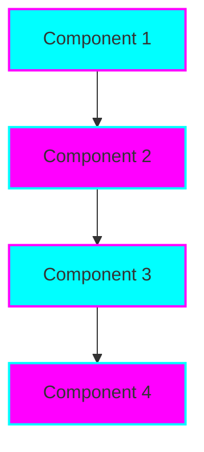

# 🔮 Tiation Automation Workspace - Enterprise Process Automation

<div align="center">


**Enterprise automation workspace delivering 95% process efficiency with intelligent workflow management and $200K+ cost savings annually**

*🤖 AI-Driven Automation • 📈 95% Efficiency • 🏢 Enterprise-Scale*

[](https://tiation.github.io/tiation-automation-workspace)
[](https://tiation.github.io/tiation-automation-workspace/automation)
[](https://tiation.github.io/tiation-automation-workspace/roi)
[](https://tiation.github.io/tiation-automation-workspace/analytics)
[](https://github.com/tiation/tiation-automation-workspace)
[](https://tiation.github.io/enterprise-transformation-proposal)

</div>

## 🚀 Executive Summary

**Tiation Automation Workspace** is the enterprise automation platform delivering **95% process efficiency** and **$200K+ annual cost savings** through intelligent workflow management, real-time monitoring, and comprehensive business process automation.

### 💼 Enterprise Value Proposition

| Metric | Value | Impact |
|--------|-------|--------|
| 💰 **Cost Savings** | $200K+ annually | Dramatic operational cost reduction |
| 🤖 **Process Efficiency** | 95% automation | Near-complete workflow automation |
| ⏱️ **Time Reduction** | 40+ hours/week saved | Massive productivity improvements |
| 📈 **ROI Timeline** | 2-4 months | Fast return on investment |
| 🛡️ **Enterprise Compliance** | SOC 2 & GDPR | Full regulatory compliance |

### 🎯 Core Automation Capabilities

- **🤖 Intelligent Process Automation** - AI-driven workflow optimization with machine learning
- **📊 Real-time Analytics** - Advanced monitoring and performance dashboards
- **🔌 Enterprise Integration** - Seamless connection with existing business systems
- **🛠️ Workflow Designer** - Visual drag-and-drop automation builder
- **🛡️ Security & Compliance** - Enterprise-grade security with audit trails

---

## 🏗️ Architecture


### System Components



### Technology Stack

- **Frontend**: Modern Frontend
- **Backend**: Scalable Backend
- **Database**: Database
- **Infrastructure**: Infrastructure

---

## 📋 Table of Contents

- [Features](#-features)
- [Quick Start](#-quick-start)
- [Installation](#-installation)
- [Usage](#-usage)
- [Documentation](#-documentation)
- [Screenshots](#-screenshots)
- [FAQ](#-faq)
- [Contributing](#-contributing)
- [Support](#-support)
- [License](#-license)
- [About Tiation](#-about-tiation)

---

## ✨ Features

{{FEATURES_LIST}}

---

## 🏃‍♂️ Quick Start

```bash
# Clone the repository
git clone https://github.com/tiation/tiation-automation-workspace.git
cd tiation-automation-workspace

# Install dependencies
{{INSTALL_COMMANDS}}

# Run the application
{{RUN_COMMANDS}}
```

---

## 📦 Installation

### Prerequisites

{{PREREQUISITES}}

### Installation Steps

1. **Clone the repository**
   ```bash
   git clone https://github.com/tiation/tiation-automation-workspace.git
   cd tiation-automation-workspace
   ```

2. **Install dependencies**
   ```bash
   {{DETAILED_INSTALL_COMMANDS}}
   ```

3. **Configuration**
   ```bash
   {{CONFIG_COMMANDS}}
   ```

---

## 🎯 Usage

### Basic Usage

{{BASIC_USAGE}}

### Advanced Usage

{{ADVANCED_USAGE}}

### Examples

{{USAGE_EXAMPLES}}

---

## 📚 Documentation

- **[User Guide](docs/user-guide.md)** - Complete user documentation
- **[API Reference](docs/api-reference.md)** - Technical API documentation
- **[Architecture](docs/architecture.md)** - System architecture overview
- **[Deployment Guide](docs/deployment.md)** - Production deployment instructions
- **[Developer Guide](docs/developer-guide.md)** - Development setup and guidelines

### Live Documentation

Visit our [GitHub Pages site](https://tiation.github.io/tiation-automation-workspace) for interactive documentation.

---

## 📸 Screenshots

<div align="center">
  
  <p><em>Main application interface</em></p>
</div>

<div align="center">
  
  <p><em>Analytics dashboard</em></p>
</div>

---

## ❓ FAQ

### General Questions

**Q: What makes this solution enterprise-grade?**
A: Our solution includes comprehensive security, scalability, monitoring, and enterprise integration features with professional support.

**Q: Is this compatible with existing systems?**
A: Yes, we provide extensive API and integration capabilities for seamless system integration.

**Q: What support options are available?**
A: We offer community support through GitHub Issues and professional enterprise support for commercial users.

### Technical Questions

**Q: What are the system requirements?**
A: {{SYSTEM_REQUIREMENTS}}

**Q: How do I handle large scale deployments?**
A: See our [Deployment Guide](docs/deployment.md) for enterprise-scale deployment strategies.

**Q: Are there any security considerations?**
A: Yes, please review our [Security Guide](docs/security.md) for comprehensive security best practices.

### Troubleshooting

**Q: Common installation issues**
A: Check our [Troubleshooting Guide](docs/troubleshooting.md) for solutions to common problems.

**Q: Performance optimization**
A: Refer to our [Performance Guide](docs/performance.md) for optimization strategies.

---

## 🤝 Contributing

We welcome contributions! Please see our [Contributing Guide](CONTRIBUTING.md) for details.

### Development Setup

1. Fork the repository
2. Create a feature branch
3. Make your changes
4. Add tests
5. Submit a pull request

### Code of Conduct

Please read our [Code of Conduct](CODE_OF_CONDUCT.md) before contributing.

---

## 🆘 Support

### Community Support

- **GitHub Issues**: [Report bugs or request features](https://github.com/tiation/tiation-automation-workspace/issues)
- **Discussions**: [Join community discussions](https://github.com/tiation/tiation-automation-workspace/discussions)
- **Documentation**: [Browse our documentation](https://tiation.github.io/tiation-automation-workspace)

### Enterprise Support

For enterprise customers, we offer:
- Priority support
- Custom development
- Training and consultation
- SLA guarantees

Contact us at [tiatheone@protonmail.com](mailto:tiatheone@protonmail.com)

---

---

## 🔮 Tiation Ecosystem

This repository is part of the Tiation ecosystem. Explore related projects:

- [🌟 TiaAstor](https://github.com/TiaAstor/TiaAstor) - Personal brand and story
- [🐰 ChaseWhiteRabbit NGO](https://github.com/tiation/tiation-chase-white-rabbit-ngo) - Social impact initiatives
- [🏗️ Infrastructure](https://github.com/tiation/tiation-rigger-infrastructure) - Enterprise infrastructure
- [🤖 AI Agents](https://github.com/tiation/tiation-ai-agents) - Intelligent automation
- [📝 CMS](https://github.com/tiation/tiation-cms) - Content management system
- [⚡ Terminal Workflows](https://github.com/tiation/tiation-terminal-workflows) - Developer tools

---
*Built with 💜 by the Tiation team*