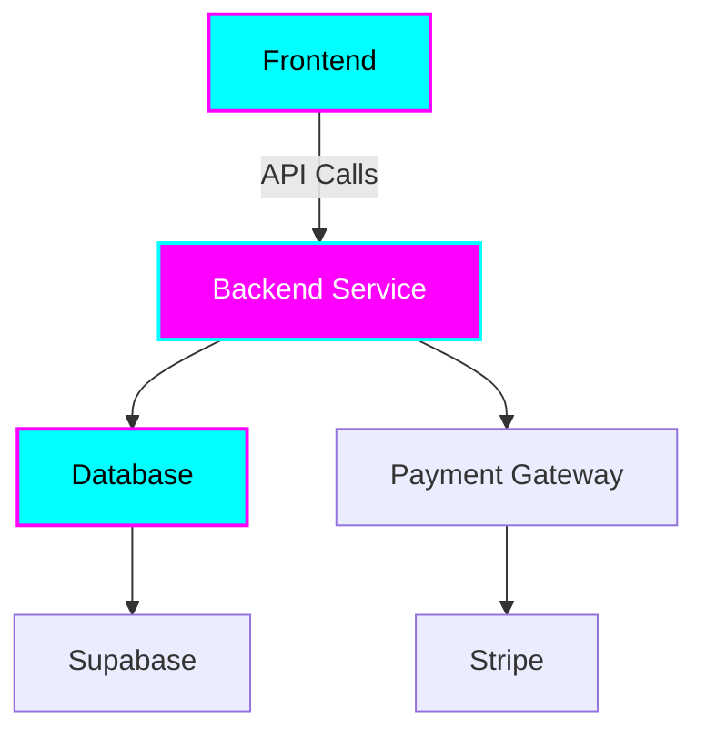

# 🚀 [PROJECT_NAME]

<div align="center">


**[Brief compelling description of your project with dark neon theme emphasis]**

[](https://[username].github.io/[repo-name])
[](#documentation)


</div>

## 🌟 Features

- 📱 **Mobile-First Design**: Optimized for all mobile devices with responsive layouts
- 🌙 **Dark Neon Theme**: Cool dark interface with cyan/magenta gradient flares
- 🏢 **Enterprise Grade**: Professional, scalable, and maintainable codebase
- 💰 **SaaS Ready**: Integrated Supabase/Stripe payment processing
- 📊 **Architecture Diagrams**: Clear visual understanding of system layout
- 🔧 **Interactive Demos**: Live demonstrations of capabilities
- 📖 **Comprehensive Documentation**: Detailed API docs and usage examples

## 🏗️ Architecture




## 🚀 Quick Start

### Prerequisites

- Node.js 18+ / Python 3.9+ / [LANGUAGE_REQUIREMENTS]
- [PLATFORM_REQUIREMENTS]
- Mobile development environment (iOS/Android)

### Installation

```bash
# Clone the repository
git clone https://github.com/[USERNAME]/[REPO_NAME].git
cd [REPO_NAME]

# Install dependencies
npm install # or pip install -r requirements.txt

# Configure environment
cp .env.example .env
# Edit .env with your configuration

# Start development server
npm run dev # or python manage.py runserver
```

### Mobile Setup

```bash
# iOS (requires Xcode)
cd ios && pod install
npx react-native run-ios

# Android
npx react-native run-android
```

## 📱 Mobile Optimization

This project prioritizes mobile-first development:

- ✅ Responsive design for all screen sizes
- ✅ Touch-optimized interactions
- ✅ Fast loading on mobile networks
- ✅ Progressive Web App (PWA) support
- ✅ Native mobile app versions available

### Light & Dark Mode Support

- 🌞 **Light Mode**: Glowing colors with visual symmetry
- 🌙 **Dark Mode**: Neon theme with cyan/magenta gradients
- 🎨 **Enterprise Visuals**: Professional imagery and best practices

## 💼 SaaS Integration

### Payment Processing

```javascript
// Stripe Integration Example
import { loadStripe } from '@stripe/stripe-js';
const stripe = await loadStripe('pk_live_...');

// Supabase Integration Example
import { createClient } from '@supabase/supabase-js';
const supabase = createClient(url, key);
```

### Pricing Tiers

| Feature | Starter | Professional | Enterprise |
|---------|---------|--------------|------------|
| Basic Features | ✅ | ✅ | ✅ |
| Advanced Analytics | ❌ | ✅ | ✅ |
| White Label | ❌ | ❌ | ✅ |
| **Price** | $9/mo | $29/mo | $99/mo |

## 🛠️ Development

### Project Structure

```
project/
├── src/                    # Source code
├── public/                 # Public assets
├── docs/                   # Documentation
├── tests/                  # Test suites
├── assets/
│   ├── screenshots/        # Project screenshots
│   └── architecture/       # Architecture diagrams
└── deployment/             # Deployment configurations
```

### Available Scripts

```bash
npm run dev          # Start development server
npm run build        # Build for production
npm run test         # Run test suite
npm run lint         # Run linter
npm run deploy       # Deploy to GitHub Pages
```

## 📊 API Documentation

### Authentication

```bash
# Get access token
curl -X POST https://api.example.com/auth/login \
  -H "Content-Type: application/json" \
  -d '{"email": "user@example.com", "password": "password"}'
```

### Core Endpoints

| Method | Endpoint | Description |
|--------|----------|-------------|
| GET | `/api/users` | Get user list |
| POST | `/api/users` | Create user |
| GET | `/api/data` | Fetch data |
| POST | `/api/data` | Submit data |

[View Full API Documentation →](./docs/api/README.md)

## 🎨 Dark Neon Theme

This project implements a consistent dark neon theme:

```css
:root {
  --neon-cyan: #00ffff;
  --neon-magenta: #ff00ff;
  --dark-bg: #0a0a0a;
  --gradient: linear-gradient(135deg, var(--neon-cyan), var(--neon-magenta));
}
```

### Theme Features
- 🌙 Dark background with high contrast
- 💫 Cyan/magenta gradient flares
- ⚡ Glowing interactive elements
- 📱 Mobile-optimized touch targets

## 🧪 Testing

```bash
# Run all tests
npm test

# Run specific test suite
npm run test:unit
npm run test:integration
npm run test:e2e

# Generate coverage report
npm run test:coverage
```

## 🚀 Deployment

### GitHub Pages

```bash
# Deploy to GitHub Pages
npm run deploy

# Custom domain setup
echo "yourdomain.com" > public/CNAME
```

### Docker Deployment

```bash
# Build Docker image
docker build -t [PROJECT_NAME] .

# Run container
docker run -p 3000:3000 [PROJECT_NAME]
```

## 📈 Monitoring & Analytics

- 📊 Built-in analytics dashboard
- 🔍 Performance monitoring
- 🛡️ Security scanning
- 📱 Mobile usage tracking

## 🤝 Contributing

1. Fork the repository
2. Create your feature branch (`git checkout -b feature/AmazingFeature`)
3. Commit your changes (`git commit -m 'Add some AmazingFeature'`)
4. Push to the branch (`git push origin feature/AmazingFeature`)
5. Open a Pull Request

### Contribution Guidelines

- Follow the dark neon theme standards
- Ensure mobile optimization
- Include architecture diagrams for new features
- Add comprehensive tests
- Update documentation

## 📄 License

This project is licensed under the MIT License - see the [LICENSE](LICENSE) file for details.

## 🔗 Links

- [Live Demo](https://[USERNAME].github.io/[REPO_NAME])
- [Documentation](./docs/README.md)
- [GitHub Repository](https://github.com/[USERNAME]/[REPO_NAME])
- [Issue Tracker](https://github.com/[USERNAME]/[REPO_NAME]/issues)

## 👥 Team

- **[Your Name]** - *Project Lead* - [tiatheone@protonmail.com](mailto:tiatheone@protonmail.com)

## 🙏 Acknowledgments

- Dark neon theme inspiration from cyberpunk aesthetics
- Mobile-first design principles
- Enterprise architecture patterns
- Open source community contributions

---

<div align="center">

**[⭐ Star this repo if you find it useful!](https://github.com/[USERNAME]/[REPO_NAME]/stargazers)**

Made with 💜 for the enterprise mobile-first community

[](https://github.com/[USERNAME])

</div>
