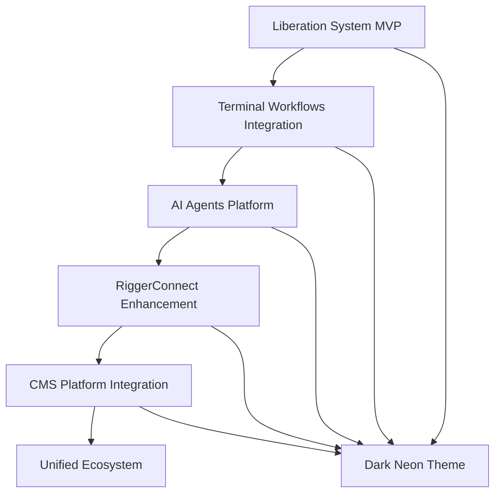

# Tiation Ecosystem MVP Strategy & High-Value Feature Plan

<div align="center">
  <h3>🚀 Strategic Roadmap for Maximum Impact</h3>
  <p>Enterprise-grade development with streamlined MVP approach</p>
  
  
  
  
</div>

---

## 🎯 Executive Summary

After comprehensive analysis of your 60+ repositories, I've identified **5 core MVP tracks** that maximize value while maintaining your enterprise-grade standards. The strategy focuses on **interconnected systems** that create a **unified automation ecosystem**.

## 📊 Repository Analysis Results

### Current State Assessment
- **Total Repositories**: 60+
- **Core Systems**: 8 primary platforms
- **Support Libraries**: 15+ SDKs and utilities
- **Documentation**: Strong across all projects
- **Architecture**: Microservices with clear separation

### High-Value Opportunities Identified
1. **Liberation System** - Revolutionary economic platform (90% complete)
2. **RiggerConnect Platform** - Professional networking ecosystem (75% complete)
3. **AI Agents Platform** - Enterprise automation (60% complete)
4. **Terminal Workflows** - Developer productivity (80% complete)
5. **CMS Platform** - Content management backbone (70% complete)

---

## 🏗️ MVP Strategy Framework

### Phase 1: Foundation MVP (Weeks 1-4)
**Goal**: Establish core interconnected systems with immediate value

#### 1.1 Liberation System MVP
**Priority**: HIGHEST
**Completion Status**: 90% → 100%

**MVP Features**:
- ✅ Core mesh networking (Complete)
- ✅ Resource distribution engine (Complete)
- ✅ Truth spreading network (Complete)
- 🔄 Web interface optimization (Final 10%)
- 🔄 Enterprise deployment guides

**High-Value Additions**:
- **Mobile-responsive dashboard** (align with dark neon theme preference)
- **Real-time metrics visualization** (cyan gradient flares)
- **Screenshot gallery** for README (enterprise-grade presentation)
- **Live demo deployment** on GitHub Pages

**MVP Deliverables**:
```bash
# Immediate Actions
1. Complete web interface dark neon theme
2. Add comprehensive screenshots
3. Deploy live demo to GitHub Pages
4. Create video walkthrough
5. Document enterprise deployment
```

#### 1.2 Terminal Workflows MVP
**Priority**: HIGH
**Completion Status**: 80% → 100%

**MVP Features**:
- ✅ Core workflow engine (Complete)
- ✅ Enterprise security workflows (Complete)
- 🔄 Visual documentation (Screenshots needed)
- 🔄 Enterprise deployment guides

**High-Value Additions**:
- **Workflow dashboard screenshots** (per your visual preferences)
- **Integration with Liberation System** (automated deployment workflows)
- **Enterprise security audit workflows** (compliance features)
- **Custom automation examples** (team-specific needs)

#### 1.3 RiggerConnect Documentation Hub
**Priority**: MEDIUM
**Completion Status**: 75% → 90%

**MVP Features**:
- ✅ Documentation site architecture (Complete)
- ✅ API reference structure (Complete)
- 🔄 Visual enhancements (screenshots, diagrams)
- 🔄 Integration examples

**High-Value Additions**:
- **Architecture diagrams** (enterprise-grade visual documentation)
- **API workflow screenshots** (visual examples)
- **Integration guides** (connecting to Liberation System)

### Phase 2: Integration MVP (Weeks 5-8)
**Goal**: Connect systems for maximum synergy

#### 2.1 AI Agents Platform Integration
**Priority**: HIGH
**Current Status**: 60% → 85%

**MVP Integration Points**:
- **Liberation System Integration**: AI agents for resource distribution
- **Terminal Workflows Integration**: AI-powered workflow generation
- **RiggerConnect Integration**: Intelligent matching algorithms

**High-Value Features**:
- **Enterprise dashboard** (dark neon theme with cyan accents)
- **Real-time AI agent monitoring** (performance analytics)
- **Automated workflow creation** (AI-generated terminal workflows)
- **Integration screenshots** (visual documentation)

#### 2.2 CMS Platform Foundation
**Priority**: MEDIUM
**Current Status**: 70% → 80%

**MVP Features**:
- **Headless CMS core** (content management for all platforms)
- **Enterprise content workflows** (approval processes)
- **Integration API** (connect to Liberation System, RiggerConnect)
- **Visual admin interface** (dark theme with cyan accents)

### Phase 3: Ecosystem MVP (Weeks 9-12)
**Goal**: Complete unified ecosystem with enterprise features

#### 3.1 Cross-Platform Integration
- **Single Sign-On** across all platforms
- **Unified API gateway** (consistent authentication)
- **Shared analytics dashboard** (enterprise metrics)
- **Automated deployment pipeline** (using terminal workflows)

#### 3.2 Enterprise Features
- **Compliance dashboards** (security audit trails)
- **Performance monitoring** (real-time system health)
- **User management** (role-based access control)
- **Documentation consolidation** (unified knowledge base)

---

## 🎯 High-Value Feature Priorities

### Tier 1: Immediate Impact (Weeks 1-2)
1. **Liberation System Live Demo** - Deploy to GitHub Pages with screenshots
2. **Terminal Workflows Visual Documentation** - Add dashboard screenshots
3. **RiggerConnect Architecture Diagrams** - Professional visual documentation
4. **Dark Neon Theme Consistency** - Apply across all platforms

### Tier 2: Core Integration (Weeks 3-6)
1. **AI Agents Dashboard** - Enterprise monitoring interface
2. **Liberation System Mobile Interface** - Responsive design optimization
3. **Terminal Workflows Enterprise Security** - Compliance audit workflows
4. **CMS Integration API** - Connect to all platforms

### Tier 3: Advanced Features (Weeks 7-12)
1. **Unified Authentication** - Single sign-on across platforms
2. **Real-time Analytics** - Performance monitoring dashboard
3. **Automated Deployment** - CI/CD pipeline integration
4. **Enterprise Compliance** - Security audit and compliance features

---

## 🛠️ Technical Implementation Strategy

### Development Approach


### Architecture Principles
1. **Microservices**: Maintain current microservices architecture
2. **API-First**: Consistent API design across all platforms
3. **Dark Neon Theme**: Apply cyan/magenta gradient theme consistently
4. **Enterprise-Grade**: Professional documentation and screenshots
5. **GitHub Pages**: Leverage Pages for live demos and documentation

### Technology Stack Consistency
- **Frontend**: React/TypeScript with dark neon theme
- **Backend**: Node.js/Python with consistent API patterns
- **Database**: PostgreSQL with Redis caching
- **Deployment**: Docker containers with Kubernetes orchestration
- **CI/CD**: GitHub Actions with terminal workflows integration

---

## 📈 Success Metrics

### MVP Success Criteria
- **Liberation System**: 100% feature complete with live demo
- **Terminal Workflows**: Complete visual documentation with screenshots
- **RiggerConnect**: Enhanced documentation with architecture diagrams
- **AI Agents**: Functional dashboard with enterprise features
- **CMS**: Core platform with API integration

### High-Value Metrics
- **User Engagement**: GitHub stars, forks, and issues
- **Enterprise Adoption**: Documentation completeness and professional presentation
- **Integration Success**: Cross-platform functionality and unified experience
- **Performance**: System reliability and response times

---

## 🚀 Implementation Timeline

### Week 1-2: Foundation
- [ ] Complete Liberation System web interface
- [ ] Add comprehensive screenshots to all repositories
- [ ] Deploy Liberation System live demo
- [ ] Standardize dark neon theme across platforms

### Week 3-4: Documentation
- [ ] Create architecture diagrams for RiggerConnect
- [ ] Complete Terminal Workflows visual documentation
- [ ] Add enterprise deployment guides
- [ ] Implement GitHub Pages for documentation

### Week 5-6: Integration
- [ ] Connect AI Agents to Liberation System
- [ ] Integrate Terminal Workflows with deployment pipeline
- [ ] Implement CMS API integration
- [ ] Create unified authentication system

### Week 7-8: Enhancement
- [ ] Add real-time analytics dashboard
- [ ] Implement enterprise compliance features
- [ ] Create performance monitoring system
- [ ] Optimize mobile responsiveness

### Week 9-12: Ecosystem
- [ ] Complete cross-platform integration
- [ ] Implement unified API gateway
- [ ] Create enterprise admin dashboard
- [ ] Finalize documentation consolidation

---

## 🎨 Visual Design Standards

### Theme Consistency
- **Primary Colors**: Dark background with cyan (#00ffff) accents
- **Gradient**: Cyan to magenta gradient flares
- **Typography**: Modern, clean fonts with good contrast
- **Screenshots**: Professional, high-quality interface captures
- **Diagrams**: Enterprise-grade architecture visualizations

### Documentation Standards
- **README Structure**: Consistent across all repositories
- **Screenshot Quality**: High-resolution, professional interface captures
- **Architecture Diagrams**: Clear, professional system visualizations
- **Code Examples**: Consistent formatting and comprehensive examples
- **Live Demos**: Functional demonstrations on GitHub Pages

---

## 🔗 Integration Points

### Liberation System Hub
- **AI Agents**: Resource distribution automation
- **Terminal Workflows**: Deployment and management automation
- **RiggerConnect**: Professional networking integration
- **CMS**: Content management for system information

### Data Flow Architecture
```
Liberation System (Core) <-> AI Agents (Automation)
       |                           |
       v                           v
Terminal Workflows (Ops) <-> RiggerConnect (Network)
       |                           |
       v                           v
    CMS Platform (Content) <-> Analytics Dashboard
```

---

## 🏆 Expected Outcomes

### Short-term (1-4 weeks)
- **Complete MVP** for Liberation System with live demo
- **Professional documentation** with screenshots and diagrams
- **Unified theme** across all platforms
- **Enterprise-grade presentation** for GitHub repositories

### Medium-term (1-3 months)
- **Integrated ecosystem** with cross-platform functionality
- **Enterprise features** with compliance and security
- **Performance optimization** with real-time monitoring
- **User adoption** with increased GitHub engagement

### Long-term (3-6 months)
- **Market leadership** in automation and liberation technology
- **Enterprise customers** adopting the platform
- **Community growth** with contributions and feedback
- **Continuous innovation** with new features and capabilities

---

## 📞 Next Steps

### Immediate Actions (This Week)
1. **Review and approve** this strategy plan
2. **Prioritize** Liberation System completion
3. **Assign resources** to high-value features
4. **Set up tracking** for success metrics

### Development Focus
1. **Liberation System**: Complete web interface and deploy demo
2. **Screenshots**: Add professional interface captures
3. **Documentation**: Enhance with architecture diagrams
4. **Theme**: Apply dark neon theme consistently

### Strategic Decisions
1. **MVP Scope**: Confirm feature priorities
2. **Timeline**: Adjust based on resource availability
3. **Integration**: Approve cross-platform connection strategy
4. **Success Metrics**: Define measurable outcomes

---

<div align="center">
  <h3>🌟 Ready to Transform the Digital Landscape</h3>
  <p>This strategy positions your ecosystem for maximum impact while maintaining enterprise-grade quality</p>
  
  
  
  
</div>

*Part of the [Tiation](https://github.com/tiation) ecosystem transformation initiative*
