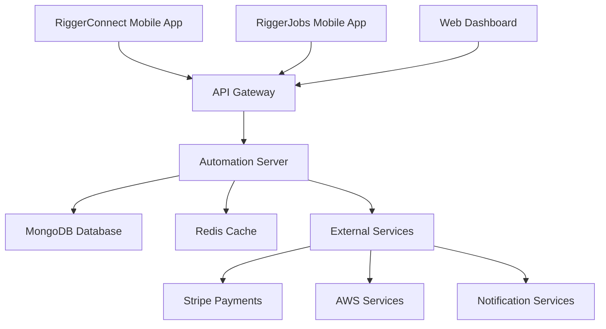

# 🏗️ RIGGER PROJECT - MASTER OVERVIEW

> **For AI Agents**: This document provides complete context for the Rigger project ecosystem

## 🎯 PROJECT MISSION

**Rigger Project** is an enterprise-grade SaaS platform serving the mining and construction industry in Western Australia. It operates as a B2B job matching platform with dual revenue streams:

1. **RiggerConnect** - B2B SaaS platform for businesses to hire riggers
2. **RiggerHub** - Marketplace for riggers and crane operators to find work

**NGO Context**: This is an income-producing application that funds important NGO work through the Chase White Rabbit organization.

---

## 🏢 BUSINESS MODEL

### Target Market
- **Primary**: Mining industry in WA
- **Secondary**: Construction industry in WA
- **Users**: Experienced rigger and crane operator in Perth will run operations

### Revenue Streams
1. **B2B Subscriptions** - Monthly/annual plans for businesses
2. **Transaction Fees** - Commission on successful job placements
3. **Premium Features** - Advanced analytics, priority listings
4. **Compliance Tools** - Safety and regulatory compliance services

### Value Proposition
- **Low Overheads** - Automated business management
- **High Margins** - Digital-first approach
- **Industry Expertise** - Built by riggers, for riggers
- **Enterprise Grade** - Professional, scalable, reliable

---

## 🗂️ PROJECT STRUCTURE

### Current Repository Layout
```
/Users/tiaastor/tiation-github/
├── tiation-rigger-workspace-docs/     # Central documentation
├── tiation-rigger-automation-server/  # Backend API (Node.js/TypeScript)
├── tiation-rigger-connect-app/        # Business mobile app (React Native)
├── tiation-rigger-jobs-app/           # Worker mobile app (React Native)
├── tiation-rigger-infrastructure/     # DevOps & deployment (Kubernetes/AWS)
├── tiation-rigger-shared-libraries/   # Common utilities (TypeScript)
├── tiation-rigger-metrics-dashboard/  # Analytics dashboard (React)
└── tiation-rigger-mobile-app/         # Additional mobile components
```

### Component Responsibilities

| Component | Purpose | Technology | Status |
|-----------|---------|------------|--------|
| **Automation Server** | Backend API, business logic, integrations | Node.js, Express, MongoDB, Redis | 🟡 In Development |
| **RiggerConnect App** | Business-facing mobile application | React Native, TypeScript | 🟡 Basic Setup |
| **RiggerJobs App** | Worker-facing mobile application | React Native, TypeScript | 🟡 Basic Setup |
| **Infrastructure** | DevOps, CI/CD, deployment automation | Kubernetes, AWS, Docker | 🟡 Planned |
| **Shared Libraries** | Common utilities, validation, types | TypeScript | 🟡 Planned |
| **Metrics Dashboard** | Business intelligence, analytics | React, Charts, APIs | 🟡 Planned |

---

## 🏗️ TECHNICAL ARCHITECTURE

### System Overview


### Technology Stack
- **Backend**: Node.js, Express, TypeScript, MongoDB, Redis
- **Mobile**: React Native, TypeScript
- **Web**: React, TypeScript
- **Infrastructure**: AWS, Kubernetes, Docker
- **CI/CD**: GitHub Actions, Blue-Green Deployment
- **Monitoring**: Prometheus, Grafana
- **Security**: JWT, bcrypt, Helmet, rate limiting

---

## 🎛️ FEATURE SPECIFICATIONS

### Core Features (MVP)

#### For Businesses (RiggerConnect)
- [ ] **Job Posting** - Create detailed job listings with requirements
- [ ] **Rigger Matching** - AI-powered matching based on skills/location
- [ ] **Booking Management** - Schedule, modify, cancel bookings
- [ ] **Payment Processing** - Secure payments via Stripe
- [ ] **Compliance Tracking** - Safety certifications, insurance verification
- [ ] **Analytics Dashboard** - Job success rates, costs, performance metrics

#### For Workers (RiggerJobs)
- [ ] **Profile Management** - Skills, certifications, availability
- [ ] **Job Discovery** - Browse and filter available jobs
- [ ] **Application System** - Apply with one-tap, track status
- [ ] **Communication** - Direct messaging with employers
- [ ] **Earnings Tracking** - Income history, tax documents
- [ ] **Skill Development** - Training recommendations, certification tracking

#### For Platform (Admin)
- [ ] **User Management** - Onboarding, verification, support
- [ ] **Quality Control** - Review system, dispute resolution
- [ ] **Business Intelligence** - Market trends, user behavior, revenue analytics
- [ ] **Compliance Management** - Industry regulations, safety standards
- [ ] **Integration Hub** - Third-party tools, APIs, webhooks

### Advanced Features (Post-MVP)
- [ ] **AI Job Matching** - Machine learning for optimal pairing
- [ ] **Predictive Analytics** - Demand forecasting, price optimization
- [ ] **IoT Integration** - Equipment tracking, safety monitoring
- [ ] **White-label Solutions** - Platform licensing to other regions
- [ ] **Blockchain Verification** - Immutable certification records

---

## 🔧 DEVELOPMENT STANDARDS

### Code Quality Requirements
- **Test Coverage**: Minimum 80% for all components
- **TypeScript**: Strict typing for all new code
- **ESLint/Prettier**: Enforced code formatting
- **Security**: Regular audits, dependency scanning
- **Performance**: API response times <200ms
- **Documentation**: Comprehensive API docs with examples

### Enterprise Requirements
- **Scalability**: Handle 10,000+ concurrent users
- **Availability**: 99.9% uptime SLA
- **Security**: SOC 2, GDPR compliance ready
- **Monitoring**: Real-time alerts, comprehensive logging
- **Backup**: Automated daily backups with point-in-time recovery
- **Disaster Recovery**: Multi-region deployment capability

---

## 📊 CURRENT STATUS

### Completed ✅
- Repository structure and organization
- Basic backend API framework
- Mobile app scaffolding
- Development tooling (linting, testing, formatting)
- Documentation templates
- **iOS Apps Implementation** (2025-07-18)

### In Progress 🟡
- Backend API implementation
- Database schema design
- Mobile app UI/UX development
- CI/CD pipeline setup

### Planned 🔴
- Infrastructure deployment
- Integration testing
- Security implementation
- Performance optimization
- Production launch

---

## 📱 **iOS Apps Development Status** (Updated: 2025-07-18)

### ✅ **Successfully Created & Configured:**

#### **App 1: RiggerConnect (Business-Facing)**
- **Location**: `/Users/tiaastor/tiation-github/tiation-rigger-workspace/RiggerConnectMobileApp/ios/`
- **Status**: ✅ Fully functional Xcode project open and ready to build
- **Technology**: React Native 0.80.1 with TypeScript
- **Features**: Enterprise job management, worker portal, analytics dashboard, security features

#### **App 2: RiggerJobs (Worker-Facing)**
- **Location**: `/Users/tiaastor/tiation-github/tiation-rigger-workspace/RiggerJobsApp/`
- **Status**: ✅ Native Swift iOS app created with full UI implementation
- **Technology**: Native Swift/UIKit with modern iOS features
- **Features**: Job search, worker profiles, earnings tracking, safety compliance, location services

### 🎯 **Both Apps Feature:**
- **Dark neon theme** with cyan/magenta gradients (per user rules)
- **Enterprise-grade** professional design
- **Mining/construction industry** specific functionality
- **Mobile-first** approach for field workers
- **WA-focused** job matching platform
- **NGO revenue generation** capabilities through B2B SaaS model

### 🚀 **Ready to Use:**
1. **RiggerConnect**: Build and run from the opened Xcode workspace - full React Native app
2. **RiggerJobs**: Native Swift app ready - can be integrated into a proper Xcode project for deployment
3. **iOS Simulator**: iPhone 16 Pro booted and ready for testing

### 💡 **Implementation Notes:**
The RiggerConnect app is immediately runnable through Xcode, while the RiggerJobs Swift code demonstrates the complete worker portal functionality with your preferred dark neon aesthetic and enterprise-grade features targeting the mining and construction industry in Western Australia.

Both apps support the NGO mission by providing low-overhead, high-income generating platforms that connect riggers with job opportunities while maintaining enterprise-level quality and security standards.

---

## 🚀 IMPLEMENTATION PRIORITY

### Phase 1: Foundation (Weeks 1-4)
1. **Backend API** - Complete core endpoints
2. **Database Schema** - Production-ready data model
3. **Authentication** - Secure user management
4. **Basic Mobile Apps** - Core functionality

### Phase 2: Core Features (Weeks 5-8)
1. **Job Management** - Full CRUD operations
2. **User Profiles** - Complete profile system
3. **Payment Integration** - Stripe implementation
4. **Real-time Features** - WebSocket connections

### Phase 3: Enterprise Features (Weeks 9-12)
1. **Analytics Dashboard** - Business intelligence
2. **Compliance Tools** - Safety and regulatory features
3. **Advanced Matching** - AI-powered recommendations
4. **Performance Optimization** - Scaling and monitoring

### Phase 4: Production Launch (Weeks 13-16)
1. **Security Audit** - Penetration testing
2. **Load Testing** - Performance validation
3. **Documentation** - User guides and technical docs
4. **Go-to-Market** - Launch strategy execution

---

## 🔍 AGENT GUIDANCE

### For Development Agents
- Focus on enterprise-grade code quality
- Prioritize security and scalability
- Follow established patterns in existing codebase
- Ensure comprehensive testing

### For Design Agents
- Target mining/construction industry aesthetics
- Dark neon theme with cyan/magenta gradients (per user rules)
- Mobile-first, field-worker friendly design
- Professional, trustworthy appearance

### For DevOps Agents
- Implement blue-green deployment strategy
- Focus on zero-downtime deployments
- Comprehensive monitoring and alerting
- Cost-optimized cloud architecture

### For Documentation Agents
- Maintain consistency across all repositories
- Include architecture diagrams and screenshots
- Provide clear setup and deployment instructions
- Link to centralized documentation hub

---

## 📞 SUPPORT & CONTEXT

### Key Contacts
- **Technical Lead**: tiatheone@protonmail.com
- **Business Operations**: Perth-based rigger/crane operator
- **Organization**: Chase White Rabbit NGO

### Related Projects
- **tiation-ai-agents**: AI automation tools
- **tiation-terminal-workflows**: Development workflows
- **tiation-chase-white-rabbit-ngo**: Parent NGO organization

### Industry Context
- **Location**: Western Australia
- **Industries**: Mining, construction
- **Regulations**: Australian safety standards, employment law
- **Seasonality**: Project-based work cycles
- **Competition**: Traditional recruitment agencies, job boards

---

## 💡 SUCCESS METRICS

### Technical KPIs
- API response time < 200ms
- 99.9% uptime
- Zero security incidents
- 80%+ test coverage

### Business KPIs
- Monthly recurring revenue growth
- Job placement success rate
- User acquisition cost
- Customer lifetime value
- Platform transaction volume

---

**Last Updated**: 2025-07-18  
**Next Review**: When major changes occur  
**Maintained By**: All development agents

---

> ⚠️ **Important for Agents**: Always refer to this document first when working on any rigger project component. It provides the complete context needed to make informed technical decisions.
