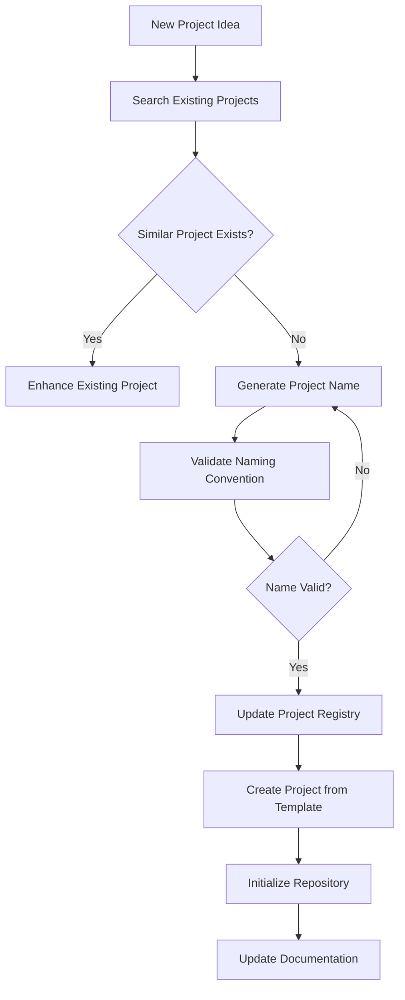

# Tiation Project Naming & Management System

## 🎯 Purpose
This document establishes a comprehensive naming convention and project management system to prevent duplication, ensure consistency, and maintain enterprise-grade organization across the Tiation ecosystem.

---

## 📐 Naming Convention Structure

### Core Pattern
```
tiation-[category]-[project-type]-[specific-name]
```

### Categories
- **`ai`** - AI/Machine Learning projects
- **`cms`** - Content Management Systems
- **`docker`** - Container/DevOps solutions
- **`rigger`** - Mining/Construction industry solutions
- **`terminal`** - CLI tools and workflows
- **`vpn`** - VPN/Network solutions
- **`github`** - GitHub-specific tools
- **`ansible`** - Infrastructure automation
- **`react`** - React-based applications
- **`svelte`** - Svelte/SvelteKit applications
- **`mobile`** - Mobile applications
- **`web`** - Web applications (when not framework-specific)

### Project Types
- **`platform`** - Large-scale platforms
- **`template`** - Reusable templates
- **`tool`** - Utility tools
- **`automation`** - Automation scripts/workflows
- **`workspace`** - Development workspaces
- **`library`** - Shared libraries/SDKs
- **`infrastructure`** - Infrastructure as code
- **`dashboard`** - Analytics/monitoring dashboards
- **`api`** - API services
- **`app`** - Applications
- **`docs`** - Documentation projects

### Examples
```
✅ tiation-ai-platform
✅ tiation-svelte-enterprise-template
✅ tiation-docker-debian-automation
✅ tiation-rigger-connect-app
✅ tiation-terminal-workflows
✅ tiation-cms-headless-platform
```

---

## 🗂️ Project Registry

### Current Projects Inventory

#### AI/Machine Learning
- `tiation-ai-platform` - Enterprise AI platform
- `tiation-ai-agents` - Intelligent automation agents
- `tiation-ai-code-assistant` - Code assistance tools
- `tiation-knowledge-base-ai` - AI knowledge management

#### Content Management
- `tiation-cms` - Content management system
- `tiation-headless-cms` - Headless CMS solution

#### Development Tools & Templates
- `tiation-svelte-enterprise-template` - SvelteKit enterprise template
- `tiation-react-template` - React application template
- `tiation-github-pages-theme` - GitHub Pages theme
- `tiation-terminal-workflows` - Terminal automation

#### Infrastructure & DevOps
- `tiation-docker-debian` - Docker on Debian solutions
- `tiation-ansible-enterprise` - Enterprise Ansible automation
- `tiation-infrastructure-charms` - Infrastructure management
- `tiation-server-configs-gae` - Google App Engine configurations

#### Rigger Ecosystem (Mining/Construction)
- `tiation-rigger-platform` - Core rigger platform
- `tiation-rigger-workspace` - Development workspace
- `tiation-rigger-connect-app` - Connection application
- `tiation-rigger-jobs-app` - Jobs management
- `tiation-rigger-mobile-app` - Mobile application
- `tiation-rigger-infrastructure` - Infrastructure management
- `tiation-rigger-automation-server` - Automation server
- `tiation-rigger-metrics-dashboard` - Analytics dashboard
- `tiation-rigger-shared-libraries` - Shared libraries
- `tiation-rigger-connect-api` - Connection API

#### Networking & Security
- `tiation-vpn-mesh-network` - VPN mesh networking
- `tiation-secure-vpn` - Secure VPN solutions

#### SDKs & Libraries
- `tiation-go-sdk` - Go SDK
- `tiation-js-sdk` - JavaScript SDK
- `tiation-java-sdk` - Java SDK
- `tiation-python-sdk` - Python SDK

#### Specialized Applications
- `tiation-invoice-generator` - Invoice generation tool
- `tiation-private-ai-chat` - Private AI chat system
- `tiation-company-intranet-template` - Company intranet template
- `tiation-fantasy-premier-league` - Fantasy sports application

#### Documentation & Guides
- `tiation-rigger-workspace-docs` - Rigger workspace documentation
- `tiation-legal-case-studies` - Legal case study documentation
- `tiation-parrot-security-guide-au` - Security guide for Australia
- `tiation-macos-networking-guide` - macOS networking guide

#### Social Impact
- `tiation-chase-white-rabbit-ngo` - NGO platform
- `tiation-economic-reform-proposal` - Economic reform documentation

---

## 🔍 Duplication Prevention System

### Pre-Creation Checklist

Before creating any new project:

1. **Search Existing Projects**
   ```bash
   # Search for similar projects
   find /Users/tiaastor/tiation-github/ -name "*[keyword]*" -type d
   grep -r "[keyword]" /Users/tiaastor/tiation-github/*/README.md
   ```

2. **Check Project Registry**
   - Review this document's project inventory
   - Verify no similar functionality exists
   - Confirm naming convention compliance

3. **Validate Naming**
   - Follows `tiation-[category]-[type]-[name]` pattern
   - Category is from approved list
   - Name is descriptive and unique
   - No special characters or spaces

### Project Creation Workflow



---

## 📊 Project Categories & Guidelines

### AI/ML Projects (`tiation-ai-*`)
- Machine learning models and platforms
- AI-powered applications and tools
- Natural language processing solutions
- Computer vision applications

### CMS Projects (`tiation-cms-*`)
- Content management systems
- Headless CMS solutions
- Blog platforms and tools
- Content delivery networks

### Development Tools (`tiation-[framework]-*`)
- Framework-specific templates and tools
- Development utilities and helpers
- Code generation and scaffolding tools
- Testing and quality assurance tools

### Infrastructure (`tiation-[infra-type]-*`)
- Container orchestration and management
- Cloud infrastructure automation
- Server configuration and management
- Monitoring and logging solutions

### Rigger Ecosystem (`tiation-rigger-*`)
- Mining and construction industry solutions
- B2B SaaS applications for mining sector
- Safety and compliance tools
- Equipment and workforce management

---

## 🛠️ Template Usage System

### Available Templates

1. **`tiation-svelte-enterprise-template`**
   - For SvelteKit applications
   - Enterprise-grade structure
   - Dark neon theme included
   - Mobile-optimized

2. **`tiation-react-template`**
   - For React applications
   - Modern React patterns
   - TypeScript included

3. **`tiation-github-pages-theme`**
   - For documentation sites
   - Static site generation
   - Responsive design

### Template Customization Process

1. **Copy Template**
   ```bash
   cp -r tiation-svelte-enterprise-template tiation-[new-project-name]
   ```

2. **Replace Placeholders**
   ```bash
   # Replace all template placeholders with actual values
   find . -type f -name "*.md" -o -name "*.json" -o -name "*.ts" -o -name "*.js" -o -name "*.svelte" -o -name "*.html" | xargs sed -i '' 's/{{PROJECT_NAME}}/Actual Project Name/g'
   ```

3. **Update Configuration**
   - Update package.json metadata
   - Configure GitHub repository settings
   - Set up deployment workflows

---

## 📝 Project Registration Process

### New Project Registration

When creating a new project:

1. **Add to Registry**
   - Update this document's project inventory
   - Include project description and purpose
   - Note template used (if any)

2. **Create Project Entry**
   ```markdown
   #### [Category]
   - `project-name` - Brief description and purpose
   ```

3. **Update Master Index**
   - Add entry to main ecosystem documentation
   - Link to project repository
   - Include status and development phase

---

## 🔄 Maintenance & Updates

### Regular Maintenance Tasks

1. **Monthly Registry Review**
   - Verify all projects are active
   - Remove deprecated projects
   - Update project descriptions

2. **Quarterly Naming Audit**
   - Ensure all projects follow naming convention
   - Identify projects that need renaming
   - Update documentation links

3. **Annual Ecosystem Review**
   - Assess project overlap and duplication
   - Consolidate similar projects
   - Plan future development roadmap

---

## 🚀 Quick Reference Commands

### Search for Existing Projects
```bash
# Find projects by keyword
find /Users/tiaastor/tiation-github/ -name "*keyword*" -type d

# Search project descriptions
grep -r "keyword" /Users/tiaastor/tiation-github/*/README.md

# List all tiation projects
ls -d /Users/tiaastor/tiation-github/tiation-*
```

### Create New Project from Template
```bash
# Copy template
cp -r tiation-svelte-enterprise-template tiation-new-project

# Replace placeholders (customize as needed)
cd tiation-new-project
find . -type f \( -name "*.md" -o -name "*.json" -o -name "*.ts" -o -name "*.js" -o -name "*.svelte" -o -name "*.html" \) -exec sed -i '' 's/{{PROJECT_NAME}}/New Project Name/g' {} +
```

### Initialize Git Repository
```bash
git init
git add .
git commit -m "feat: initial project setup from tiation-svelte-enterprise-template"
git branch -M main
git remote add origin https://github.com/tiation/project-name.git
git push -u origin main
```

---

## 🎯 Best Practices

1. **Always search before creating** - Prevent duplication
2. **Follow naming conventions** - Maintain consistency
3. **Update registry immediately** - Keep documentation current
4. **Use appropriate templates** - Leverage existing work
5. **Document project purpose** - Clear project descriptions
6. **Regular maintenance** - Keep ecosystem organized

---

<div align="center">
  <p>
    <strong>Built with ❤️ by the Tiation Team</strong>
  </p>
  <p>
    <a href="https://github.com/tiation">
      
    </a>
  </p>
</div>
