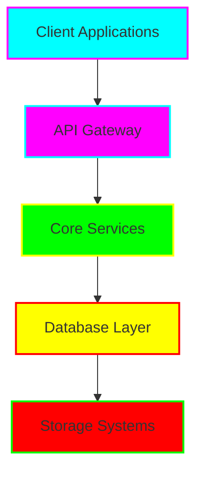

# 🌟 [Project Name]

<div align="center">
  
  
  
  [](https://github.com/tiaastor/[repo-name])
  [](https://github.com/tiaastor/[repo-name]/issues)
  [](./LICENSE)
  [](https://tiaastor.github.io/[repo-name])
  
</div>

---

## 📋 About

**[Project Name]** is a cutting-edge, enterprise-grade solution designed for [brief description]. This project showcases modern development practices, scalable architecture, and professional documentation standards.

### 🎯 Key Features

- ⚡ **High Performance**: [Feature description]
- 🔒 **Enterprise Security**: [Security features]
- 🎨 **Modern UI/UX**: Dark neon theme with cyan gradient flare
- 📱 **Responsive Design**: Mobile-first approach
- 🔧 **Developer Friendly**: Comprehensive API documentation
- 🚀 **Production Ready**: CI/CD pipeline with automated testing

---

## 🏗️ Architecture

<div align="center">
  
  
  
  *System Architecture Overview*
  
</div>

### 🧩 Component Overview



---

## 🚀 Quick Start

### 📋 Prerequisites

- Node.js 18+ or Python 3.9+
- Docker & Docker Compose
- Git
- [Additional requirements]

### 🔧 Installation

```bash
# Clone the repository
git clone https://github.com/tiaastor/[repo-name].git
cd [repo-name]

# Install dependencies
npm install  # or pip install -r requirements.txt

# Set up environment variables
cp .env.example .env

# Start the development server
npm run dev  # or python manage.py runserver
```

### 🐳 Docker Setup

```bash
# Build and run with Docker
docker-compose up -d

# View logs
docker-compose logs -f
```

---

## 💻 Usage

### 🎮 Interactive Demo

<div align="center">
  
  
  
  **[🚀 Try Live Demo](https://tiaastor.github.io/[repo-name])**
  
</div>

### 📚 Basic Examples

```javascript
// Example usage
import { TiationSDK } from 'tiation-[repo-name]';

const client = new TiationSDK({
  apiKey: process.env.TIATION_API_KEY,
  theme: 'dark-neon'
});

// Execute core functionality
const result = await client.execute({
  operation: 'example',
  parameters: { theme: 'cyan-gradient' }
});
```

### 🔌 API Reference

#### Core Endpoints

| Method | Endpoint | Description | Status |
|--------|----------|-------------|---------|
| `GET` | `/api/v1/status` | System health check | ✅ Active |
| `POST` | `/api/v1/execute` | Execute operations | ✅ Active |
| `GET` | `/api/v1/metrics` | Performance metrics | ✅ Active |

**[📖 Full API Documentation](./docs/api/README.md)**

---

## 🛠️ Development

### 🏗️ Project Structure

```
[repo-name]/
├── 📁 src/                    # Source code
│   ├── 📁 components/         # UI components
│   ├── 📁 services/          # Business logic
│   └── 📁 utils/             # Utilities
├── 📁 docs/                   # Documentation
│   ├── 📁 api/               # API documentation
│   ├── 📁 architecture/      # Architecture diagrams
│   └── 📁 guides/            # User guides
├── 📁 tests/                  # Test suites
├── 📁 docker/                 # Docker configurations
├── 📁 .github/               # GitHub workflows
└── 📁 assets/                # Static assets
```

### 🧪 Testing

```bash
# Run all tests
npm test

# Run with coverage
npm run test:coverage

# Run specific test suite
npm run test:unit
npm run test:integration
npm run test:e2e
```

### 📊 Code Quality

```bash
# Lint code
npm run lint

# Format code
npm run format

# Security audit
npm audit
```

---

## 🚀 Deployment

### 🏢 Production Deployment

```bash
# Build production version
npm run build

# Deploy to production
npm run deploy:prod
```

### 📈 Monitoring & Metrics

- **Performance**: [Monitoring dashboard link]
- **Logs**: [Logging system link]
- **Metrics**: [Metrics dashboard link]

---

## 🤝 Contributing

We welcome contributions from the community! Please read our [Contributing Guide](./CONTRIBUTING.md) for details on our code of conduct and the process for submitting pull requests.

### 📋 Contribution Guidelines

1. **Fork** the repository
2. **Create** a feature branch (`git checkout -b feature/amazing-feature`)
3. **Commit** your changes (`git commit -m 'Add amazing feature'`)
4. **Push** to the branch (`git push origin feature/amazing-feature`)
5. **Open** a Pull Request

### 👥 Contributors

<div align="center">
  
  
  
</div>

---

## 📄 License

This project is licensed under the **MIT License** - see the [LICENSE](./LICENSE) file for details.

---

## 🔗 Links & Resources

- **🏠 Homepage**: [https://github.com/tiaastor/[repo-name]](https://github.com/tiaastor/[repo-name])
- **📚 Documentation**: [./docs/README.md](./docs/README.md)
- **🐛 Issues**: [GitHub Issues](https://github.com/tiaastor/[repo-name]/issues)
- **💬 Discussions**: [GitHub Discussions](https://github.com/tiaastor/[repo-name]/discussions)
- **📧 Contact**: [tiatheone@protonmail.com](mailto:tiatheone@protonmail.com)

---

## 🙏 Acknowledgments

- **Tiation Framework** - Core development platform
- **Community Contributors** - Feature development and testing
- **Open Source Libraries** - Foundation technologies

---

<div align="center">
  
  **⭐ Star this repository if you find it useful!**
  
  
  
  *Built with 💙 by [Tiation](https://github.com/tiaastor)*
  
</div>
