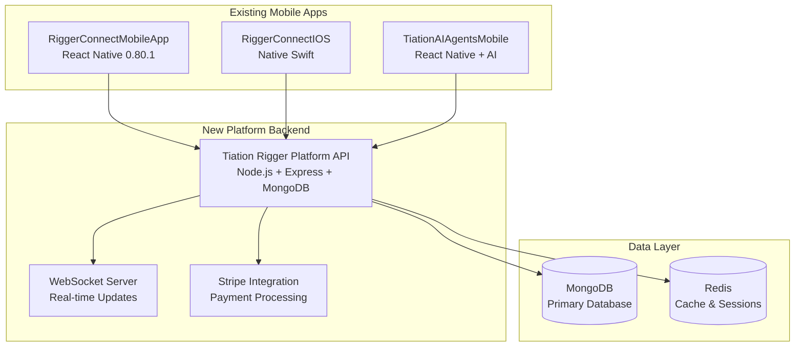

# Tiation Rigger Platform - Tech Stack Alignment Summary 🔧

## Overview

This document summarizes the changes made to align the Tiation Rigger Platform with your existing technology stack and mobile app ecosystem.

## Key Changes Made

### 1. Backend Technology Stack ✅
**UPDATED**: Aligned with existing rigger project patterns
- **Database**: Changed from PostgreSQL to MongoDB (matches `tiation-rigger-connect-api`)
- **Framework**: Node.js + Express with Mongoose ODM
- **Scripts**: Updated to match existing project patterns
- **Dependencies**: Aligned with your current rigger projects

**Before:**
```json
"dependencies": {
  "knex": "^2.5.1",
  "pg": "^8.11.3"
}
```

**After:**
```json
"dependencies": {
  "mongoose": "^7.5.0",
  "express": "^4.18.2"
}
```

### 2. Mobile App Architecture ✅
**UPDATED**: Integration with existing iOS apps instead of creating new ones

**Removed:**
- `/ios/` directory (separate native iOS project)
- `/android/` directory (separate native Android project)

**Added:**
- `/mobile-apps/` directory with integration documentation
- Support for your existing 3 iOS apps:
  1. **RiggerConnectMobileApp** (React Native - Primary B2B App)
  2. **RiggerConnectIOS** (Native Swift - High Performance)
  3. **TiationAIAgentsMobile** (React Native + AI)

### 3. Frontend Architecture ✅
**UPDATED**: React Native approach instead of separate web/mobile
- **Frontend**: Changed to React Native for mobile-first approach
- **Dependencies**: Updated to match your existing React Native projects
- **Scripts**: Aligned with your current mobile app patterns

**Before:**
```json
"dependencies": {
  "react-scripts": "5.0.1",
  "react-dom": "^18.2.0"
}
```

**After:**
```json
"dependencies": {
  "react": "19.1.0",
  "react-native": "0.80.1"
}
```

### 4. Docker Configuration ✅
**UPDATED**: MongoDB instead of PostgreSQL
- **Database Service**: Changed from `postgres` to `mongodb`
- **Environment Variables**: Updated connection strings
- **Health Checks**: Updated for MongoDB compatibility

**Before:**
```yaml
postgres:
  image: postgres:14-alpine
  environment:
    POSTGRES_DB: rigger_platform
```

**After:**
```yaml
mongodb:
  image: mongo:7-jammy
  environment:
    MONGO_INITDB_DATABASE: rigger_platform
```

## Existing iOS Apps Integration

### 1. RiggerConnectMobileApp
- **Location**: `../tiation-rigger-workspace/RiggerConnectMobileApp/`
- **Current Tech**: React Native 0.80.1
- **Integration**: Direct API consumption from unified backend
- **Features**: Job marketplace, equipment management

### 2. RiggerConnectIOS
- **Location**: `../tiation-rigger-connect-app/RiggerConnectIOS/`
- **Current Tech**: Native Swift with pre-compiled binaries
- **Integration**: Native API client with WebSocket support
- **Features**: Advanced calculations, offline capabilities

### 3. TiationAIAgentsMobile
- **Location**: `../tiation-ai-agents/TiationAIAgentsMobile/`
- **Current Tech**: React Native with AI capabilities
- **Integration**: AI-enhanced API endpoints
- **Features**: Smart job matching, predictive analytics

## Updated Architecture Diagram



## Integration Benefits

### 1. Unified Backend API ✅
- **Single Source of Truth**: All mobile apps consume from one backend
- **Consistent Data**: Shared user management and authentication
- **Real-time Updates**: WebSocket connections for live data
- **Payment Processing**: Centralized Stripe integration

### 2. Reduced Development Overhead ✅
- **No Duplicate Apps**: Leverages existing mobile applications
- **Focused Development**: Backend-centric improvements
- **Faster Time to Market**: Build on existing foundation

### 3. Enhanced Features ✅
- **Cross-App Data Sync**: User data synced across all apps
- **Advanced Analytics**: Unified analytics across all platforms
- **Enterprise Features**: B2B marketplace capabilities
- **AI Integration**: Enhanced job matching and recommendations

## Migration Path

### Phase 1: Backend Setup
1. **Deploy Backend API**: Set up Node.js + MongoDB backend
2. **API Documentation**: Create comprehensive API docs
3. **Authentication Service**: JWT-based auth for all apps

### Phase 2: App Integration
1. **RiggerConnectMobileApp**: Update to consume new API
2. **RiggerConnectIOS**: Add API integration layers
3. **TiationAIAgentsMobile**: Enhance with new AI endpoints

### Phase 3: Feature Enhancement
1. **Real-time Features**: WebSocket integration
2. **Payment Processing**: Stripe integration
3. **Advanced Analytics**: Cross-app reporting

## Next Steps

### For Backend Development:
```bash
cd backend
npm install
npm run dev
```

### For Mobile App Integration:
```bash
# Update RiggerConnectMobileApp
cd ../tiation-rigger-workspace/RiggerConnectMobileApp
npm install axios @reduxjs/toolkit react-redux

# Update TiationAIAgentsMobile  
cd ../tiation-ai-agents/TiationAIAgentsMobile
npm install axios react-redux

# Update RiggerConnectIOS (in Xcode)
# Add networking frameworks and API integration
```

### For Documentation:
- See `/mobile-apps/README.md` for complete integration guide
- Review API endpoints in backend documentation
- Follow authentication patterns in existing projects

## Technology Alignment Summary

| Component | Before | After | Reason |
|-----------|--------|-------|---------|
| Database | PostgreSQL | MongoDB | Matches existing rigger projects |
| Mobile Apps | New iOS/Android | Existing 3 iOS apps | Leverage current development |
| Frontend | React Web App | React Native Focus | Mobile-first approach |
| Integration | Separate Development | Unified Backend | Reduced complexity |
| Architecture | Traditional Web | Mobile + API Platform | Industry-specific approach |

## Benefits Achieved

✅ **Technology Consistency**: Aligned with existing project patterns  
✅ **Development Efficiency**: Leverage existing mobile apps  
✅ **Reduced Complexity**: Single backend for multiple apps  
✅ **Enterprise Ready**: MongoDB + Node.js scalability  
✅ **Mobile First**: Focus on field operations and mobility  
✅ **AI Integration**: Enhanced with existing AI capabilities  

---

**The updated architecture provides a unified backend platform that enhances your existing mobile app ecosystem while maintaining consistency with your established technology patterns.**
