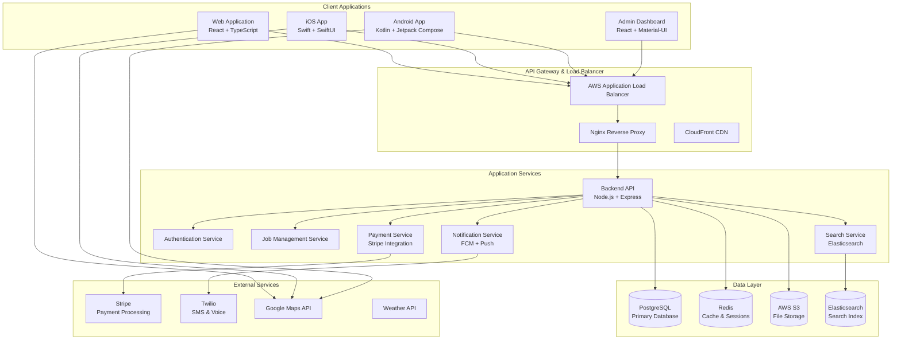
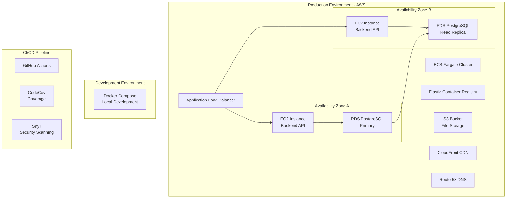
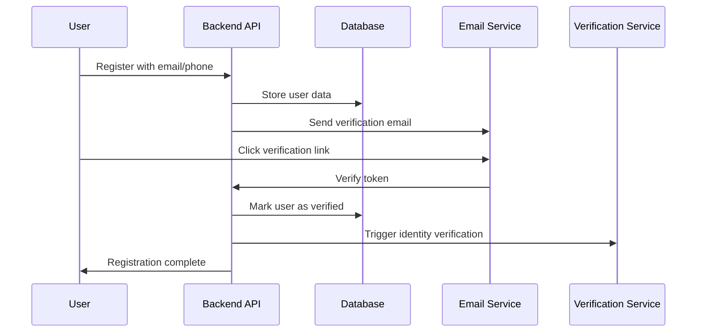
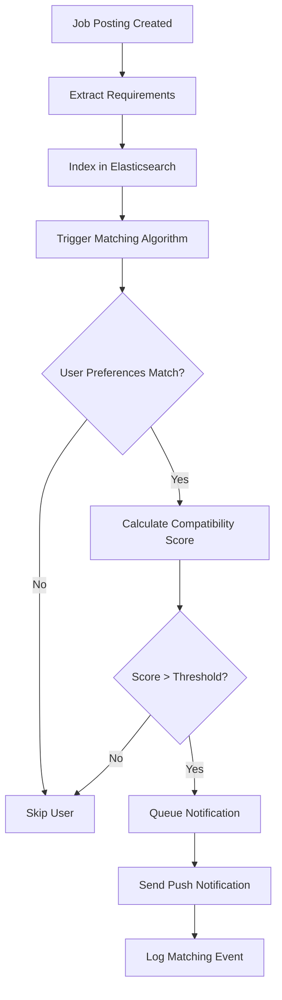

# Tiation Rigger Platform - System Architecture 🏗️

## Overview

The Tiation Rigger Platform is built using a modern, scalable microservices architecture designed to handle enterprise-level workloads in the mining and construction industries. This document outlines the system architecture, data flow, and technical decisions.

## High-Level Architecture



## System Components

### Frontend Applications

#### Web Application (React)
- **Framework**: React 18 with TypeScript
- **State Management**: Redux Toolkit + RTK Query
- **UI Framework**: Material-UI with custom dark neon theme
- **Build Tool**: Create React App with custom webpack config
- **Deployment**: GitHub Pages with custom domain
- **Features**:
  - Progressive Web App (PWA) capabilities
  - Offline functionality with service workers
  - Real-time updates via WebSocket
  - Responsive design for all screen sizes
  - Accessibility compliance (WCAG 2.1 AA)

#### Existing iOS Apps Integration

**1. RiggerConnectMobileApp (Primary B2B App)**
- **Location**: `../tiation-rigger-workspace/RiggerConnectMobileApp/`
- **Framework**: React Native 0.80.1
- **Features**: Job marketplace, equipment management, business tools
- **Integration**: Direct API consumption from unified backend

**2. RiggerConnectIOS (Native Swift App)**
- **Location**: `../tiation-rigger-connect-app/RiggerConnectIOS/`
- **Framework**: Native Swift with pre-compiled binaries
- **Features**: Advanced calculations, offline capabilities, high-performance operations
- **Integration**: Native API client with WebSocket support

**3. TiationAIAgentsMobile (AI-Powered App)**
- **Location**: `../tiation-ai-agents/TiationAIAgentsMobile/`
- **Framework**: React Native with AI capabilities
- **Features**: Smart job matching, predictive analytics, recommendations
- **Integration**: AI-enhanced API endpoints with machine learning features

### Backend Services

#### Main API Server (Node.js)
```javascript
// High-level API structure
const server = {
  framework: 'Express.js',
  authentication: 'JWT + Refresh Tokens',
  validation: 'Joi + Express Validator',
  documentation: 'Swagger/OpenAPI 3.0',
  logging: 'Winston + Morgan',
  monitoring: 'Prometheus + Grafana',
  testing: 'Jest + Supertest'
}
```

**Key Features**:
- RESTful API design with GraphQL endpoint for complex queries
- Rate limiting and DDoS protection
- Request/response compression
- CORS configuration for multiple origins
- Health check endpoints for monitoring
- Graceful shutdown handling

#### Authentication & Authorization
- **Primary**: JWT-based authentication
- **Secondary**: OAuth 2.0 integration (Google, LinkedIn)
- **Session Management**: Redis-based session storage
- **Role-Based Access Control** (RBAC):
  - **Admin**: Full system access
  - **Company**: Manage jobs and view applications
  - **Rigger**: Apply for jobs and manage profile
  - **Crane Operator**: Specialized rigging roles
  - **Guest**: Limited read-only access

#### Database Architecture

##### PostgreSQL Schema Design
```sql
-- Core entity relationships
Users (1:N) Applications (N:1) Jobs (N:1) Companies
Users (1:N) Certifications
Users (1:N) Work_History
Jobs (1:N) Job_Requirements
Companies (1:N) Equipment_Listings
```

**Key Tables**:
- `users` - User profiles and authentication
- `companies` - Business entities and verification
- `jobs` - Job postings with requirements
- `applications` - Job application tracking
- `certifications` - Professional certifications
- `equipment` - Equipment listings and availability
- `transactions` - Payment and billing records
- `notifications` - System notifications
- `audit_logs` - System activity tracking

##### Redis Caching Strategy
```javascript
const cacheStrategy = {
  sessions: 'TTL: 24 hours',
  jobListings: 'TTL: 5 minutes',
  userProfiles: 'TTL: 1 hour',
  searchResults: 'TTL: 15 minutes',
  rateLimit: 'TTL: 1 hour'
}
```

### Infrastructure & Deployment

#### AWS Cloud Architecture


#### Container Orchestration
```yaml
# Docker Compose Production Configuration
version: '3.8'
services:
  backend:
    image: tiation-rigger-backend:latest
    replicas: 3
    resources:
      limits:
        memory: 512M
        cpu: '0.5'
    healthcheck:
      test: ["CMD", "curl", "-f", "http://localhost:3000/health"]
      interval: 30s
      timeout: 10s
      retries: 3
```

### Security Architecture

#### Data Protection
- **Encryption at Rest**: AES-256 for database and file storage
- **Encryption in Transit**: TLS 1.3 for all communications
- **API Security**: OAuth 2.0 + JWT with refresh token rotation
- **Input Validation**: Comprehensive sanitization and validation
- **SQL Injection Prevention**: Parameterized queries only
- **XSS Protection**: Content Security Policy headers
- **CSRF Protection**: SameSite cookies + CSRF tokens

#### Compliance & Auditing
- **GDPR Compliance**: User data portability and deletion
- **Australian Privacy Act**: Local data handling requirements
- **Mining Industry Standards**: WA safety regulation compliance
- **Audit Logging**: Comprehensive activity tracking
- **Data Retention**: Configurable retention policies
- **Backup & Recovery**: Daily automated backups with 30-day retention

### Monitoring & Observability

#### Application Monitoring
```javascript
const monitoring = {
  metrics: 'Prometheus + Grafana dashboards',
  logging: 'Winston → CloudWatch Logs',
  tracing: 'OpenTelemetry → AWS X-Ray',
  errorTracking: 'Sentry integration',
  uptime: 'Pingdom external monitoring',
  alerts: 'PagerDuty integration'
}
```

#### Key Metrics Tracked
- **Performance**: Response times, throughput, error rates
- **Business**: User registrations, job applications, payment processing
- **Infrastructure**: CPU, memory, disk usage, database performance
- **Security**: Failed login attempts, suspicious activity patterns
- **User Experience**: Page load times, mobile app crash rates

### Scalability Considerations

#### Horizontal Scaling
- **API Servers**: Load balanced across multiple instances
- **Database**: Read replicas for query distribution
- **File Storage**: CDN with edge caching
- **Cache Layer**: Redis cluster for high availability
- **Background Jobs**: Queue-based processing with worker scaling

#### Performance Optimization
```javascript
const optimizations = {
  database: 'Connection pooling + query optimization',
  caching: 'Multi-layer caching strategy',
  cdn: 'Static asset optimization',
  compression: 'Gzip + Brotli compression',
  imageOptimization: 'WebP format + responsive images',
  bundleOptimization: 'Code splitting + tree shaking'
}
```

### Data Flow Architecture

#### User Registration & Onboarding


#### Job Matching Algorithm


### Mobile App Architecture

#### iOS App Structure
```
RiggerPlatform/
├── App/
│   ├── AppDelegate.swift
│   └── SceneDelegate.swift
├── Core/
│   ├── Network/
│   │   ├── APIClient.swift
│   │   └── NetworkError.swift
│   ├── Storage/
│   │   ├── CoreDataStack.swift
│   │   └── UserDefaults+Extensions.swift
│   └── Utils/
├── Features/
│   ├── Authentication/
│   ├── Dashboard/
│   ├── Jobs/
│   └── Profile/
└── UI/
    ├── Components/
    └── Theme/
```

#### Android App Structure
```
app/src/main/java/com/tiation/rigger/
├── data/
│   ├── local/
│   │   ├── database/
│   │   └── preferences/
│   ├── remote/
│   │   ├── api/
│   │   └── dto/
│   └── repository/
├── domain/
│   ├── model/
│   ├── repository/
│   └── usecase/
├── presentation/
│   ├── ui/
│   └── viewmodel/
└── di/
```

### API Design Principles

#### RESTful Endpoints
```javascript
const apiEndpoints = {
  // User Management
  'POST /auth/login': 'Authenticate user',
  'GET /users/profile': 'Get user profile',
  'PUT /users/profile': 'Update user profile',
  
  // Job Management
  'GET /jobs': 'List jobs with filtering',
  'POST /jobs': 'Create new job posting',
  'GET /jobs/:id': 'Get specific job details',
  'POST /jobs/:id/apply': 'Apply for job',
  
  // Equipment Management
  'GET /equipment': 'List available equipment',
  'POST /equipment': 'Add equipment listing',
  'PUT /equipment/:id': 'Update equipment details',
  
  // Payment Processing
  'POST /payments/intent': 'Create payment intent',
  'POST /payments/confirm': 'Confirm payment',
  'GET /payments/history': 'Payment history'
}
```

#### GraphQL Schema (Optional Advanced Queries)
```graphql
type User {
  id: ID!
  email: String!
  profile: UserProfile
  applications: [JobApplication!]!
  certifications: [Certification!]!
}

type Job {
  id: ID!
  title: String!
  description: String!
  requirements: [JobRequirement!]!
  company: Company!
  applications: [JobApplication!]!
  location: Location!
  salary: SalaryRange
}

type Query {
  jobs(filter: JobFilter, location: LocationInput, radius: Int): [Job!]!
  user(id: ID!): User
  equipment(filter: EquipmentFilter): [Equipment!]!
}

type Mutation {
  applyForJob(jobId: ID!, applicationData: ApplicationInput!): JobApplication!
  createJob(jobData: JobInput!): Job!
  updateProfile(profileData: ProfileInput!): UserProfile!
}
```

## Development Workflow

### Local Development Setup
1. **Clone repository**: `git clone https://github.com/tiation/tiation-rigger-platform.git`
2. **Start services**: `docker-compose up -d`
3. **Install dependencies**: `npm install` in backend/frontend directories
4. **Run migrations**: `npm run migrate`
5. **Start development**: `npm run dev`

### Testing Strategy
- **Unit Tests**: Jest for backend, Jest + RTL for frontend
- **Integration Tests**: Supertest for API endpoints
- **E2E Tests**: Cypress for critical user flows
- **Mobile Tests**: XCTest for iOS, Espresso for Android
- **Load Tests**: Artillery for performance testing

### Deployment Pipeline
1. **Code Push** → GitHub Actions triggered
2. **Tests Run** → Unit, integration, and security scans
3. **Build Images** → Docker images for production
4. **Deploy Staging** → Automatic deployment to staging environment
5. **Manual Approval** → Required for production deployment
6. **Deploy Production** → Blue-green deployment strategy
7. **Post-Deploy** → Health checks and rollback capability

## Future Architecture Considerations

### Phase 2 Enhancements
- **Microservices**: Break down monolithic API into domain services
- **Event-Driven Architecture**: Implement event sourcing for complex workflows
- **Machine Learning**: Job matching optimization and predictive analytics
- **IoT Integration**: Equipment sensor data integration
- **Blockchain**: Certification verification on distributed ledger

### Scalability Roadmap
- **Multi-Region**: Deployment across multiple AWS regions
- **Edge Computing**: Lambda@Edge for global performance
- **Database Sharding**: Horizontal database partitioning
- **Service Mesh**: Istio for microservices communication
- **Serverless**: Transition to serverless architecture where appropriate

---

**This architecture is designed to scale from startup to enterprise while maintaining performance, security, and reliability standards required for the mining and construction industries.**
