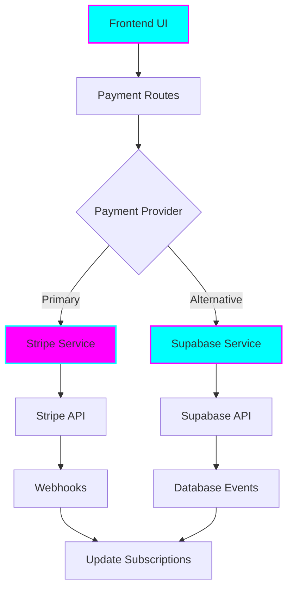

# 💰 SaaS Monetization Setup Guide - Tiation Rigger Platform

<div align="center">


**Enterprise-grade payment processing and subscription management**

*Stripe Integration • Supabase Support • B2B Marketplace • Recurring Billing*

</div>

## 🚀 Overview

This guide provides complete setup instructions for implementing SaaS monetization in the Tiation Rigger Platform using both **Stripe** and **Supabase** payment processing solutions.

### 💼 Revenue Model

- **B2B SaaS Subscriptions**: $29-$199/month recurring revenue
- **Marketplace Transactions**: 5% commission on equipment rentals and services
- **Premium Features**: Tiered access to advanced functionality
- **Enterprise Plans**: Custom pricing for large organizations

---

## 🏗️ Architecture Overview



---

## 📦 Installation & Setup

### 1. Install Dependencies

The required dependencies are already included in `package.json`:

```bash
# Navigate to backend directory
cd backend

# Install dependencies
npm install

# Verify Stripe and Supabase packages
npm list stripe @supabase/supabase-js
```

### 2. Environment Configuration

Copy the environment template and configure your keys:

```bash
cp .env.example .env
```

Configure the following environment variables in `.env`:

#### Stripe Configuration
```env
# Stripe Keys (Get from https://dashboard.stripe.com/apikeys)
STRIPE_PUBLIC_KEY=pk_test_your_publishable_key_here
STRIPE_SECRET_KEY=sk_test_your_secret_key_here
STRIPE_WEBHOOK_SECRET=whsec_your_webhook_secret_here

# Stripe Settings
STRIPE_CURRENCY=aud
STRIPE_MARKETPLACE_FEE_PERCENTAGE=5.0
STRIPE_MINIMUM_FEE_CENTS=250
```

#### Supabase Configuration
```env
# Supabase Keys (Get from https://supabase.com/dashboard/project/your-project/settings/api)
SUPABASE_URL=https://your-project.supabase.co
SUPABASE_ANON_KEY=your-anon-key-here
SUPABASE_SERVICE_KEY=your-service-role-key-here
```

### 3. Database Schema Setup

#### For Stripe Integration
```sql
-- Add Stripe customer ID to users table
ALTER TABLE users ADD COLUMN stripe_customer_id VARCHAR(255);
ALTER TABLE users ADD COLUMN stripe_subscription_id VARCHAR(255);
ALTER TABLE users ADD COLUMN subscription_plan VARCHAR(50);
ALTER TABLE users ADD COLUMN subscription_status VARCHAR(50);

-- Create payments table
CREATE TABLE payments (
    id SERIAL PRIMARY KEY,
    user_id INTEGER REFERENCES users(id),
    stripe_payment_intent_id VARCHAR(255),
    amount INTEGER NOT NULL,
    currency VARCHAR(3) DEFAULT 'aud',
    status VARCHAR(50),
    description TEXT,
    metadata JSONB,
    created_at TIMESTAMP DEFAULT NOW(),
    updated_at TIMESTAMP DEFAULT NOW()
);

-- Create subscriptions table
CREATE TABLE subscriptions (
    id SERIAL PRIMARY KEY,
    user_id INTEGER REFERENCES users(id),
    stripe_subscription_id VARCHAR(255) UNIQUE,
    plan_id VARCHAR(50),
    status VARCHAR(50),
    current_period_start TIMESTAMP,
    current_period_end TIMESTAMP,
    cancel_at_period_end BOOLEAN DEFAULT FALSE,
    metadata JSONB,
    created_at TIMESTAMP DEFAULT NOW(),
    updated_at TIMESTAMP DEFAULT NOW()
);
```

#### For Supabase Integration
```sql
-- Supabase tables (create in Supabase dashboard)
CREATE TABLE subscriptions (
    id SERIAL PRIMARY KEY,
    user_id UUID REFERENCES auth.users(id),
    plan_id VARCHAR(50),
    status VARCHAR(50) DEFAULT 'active',
    created_at TIMESTAMP DEFAULT NOW()
);

CREATE TABLE transactions (
    id SERIAL PRIMARY KEY,
    user_id UUID REFERENCES auth.users(id),
    amount DECIMAL(10,2),
    description TEXT,
    status VARCHAR(50) DEFAULT 'completed',
    created_at TIMESTAMP DEFAULT NOW()
);
```

---

## 🎯 Usage Guide

### Frontend Integration

#### Stripe Elements Integration

```javascript
// Install Stripe SDK
npm install @stripe/stripe-js

// Initialize Stripe
import { loadStripe } from '@stripe/stripe-js';
const stripe = await loadStripe(process.env.REACT_APP_STRIPE_PUBLIC_KEY);

// Create subscription
const createSubscription = async (planId) => {
    const response = await fetch('/api/payments/stripe/subscriptions', {
        method: 'POST',
        headers: {
            'Content-Type': 'application/json',
            'Authorization': `Bearer ${authToken}`
        },
        body: JSON.stringify({
            customer_id: userStripeId,
            plan_id: planId
        })
    });
    
    const { client_secret } = await response.json();
    return stripe.confirmPayment({
        elements,
        confirmParams: {
            return_url: `${window.location.origin}/subscription/complete`
        }
    });
};
```

### Backend API Usage

#### 1. Create Customer and Subscription

```javascript
// Create Stripe customer
POST /api/payments/stripe/customers
{
    "name": "John Rigger",
    "email": "john@example.com",
    "phone": "+61400123456",
    "company": "Rigger Solutions Pty Ltd"
}

// Create subscription
POST /api/payments/stripe/subscriptions
{
    "customer_id": "cus_stripe_customer_id",
    "plan_id": "professional",
    "payment_method_id": "pm_card_visa"
}
```

#### 2. Process Marketplace Transaction

```javascript
// Equipment rental payment
POST /api/payments/stripe/marketplace/transactions
{
    "amount": 50000,  // $500.00 AUD in cents
    "seller_id": "acct_connected_account_id",
    "description": "Crane rental - 2 days",
    "metadata": {
        "equipment_id": "crane_001",
        "rental_period": "2024-01-15 to 2024-01-17"
    }
}
```

#### 3. Manage Subscriptions

```javascript
// Update subscription
PUT /api/payments/stripe/subscriptions/sub_1234567890
{
    "plan_id": "enterprise"
}

// Cancel subscription
DELETE /api/payments/stripe/subscriptions/sub_1234567890
{
    "cancel_at_period_end": true
}
```

---

## 💳 Subscription Plans

### Available Plans

| Plan | Price (AUD/month) | Features |
|------|------------------|----------|
| **Basic Rigger** | $29 | Job posting, Basic matching, Email support |
| **Professional** | $79 | Unlimited jobs, Advanced matching, Priority support, Analytics |
| **Enterprise** | $199 | White-label, Custom integrations, 24/7 support, Multi-tenant |

### Marketplace Fee Structure

- **Commission**: 5% of transaction value
- **Minimum Fee**: $2.50 per transaction
- **Payment Processing**: Stripe standard rates apply

---

## 🔧 Webhook Configuration

### Stripe Webhooks

Configure webhooks in your Stripe dashboard to point to:
```
https://your-domain.com/api/payments/stripe/webhook
```

Required webhook events:
- `customer.subscription.created`
- `customer.subscription.updated`
- `customer.subscription.deleted`
- `invoice.payment_succeeded`
- `invoice.payment_failed`
- `account.updated`

### Testing Webhooks Locally

```bash
# Install Stripe CLI
npm install -g stripe-cli

# Login to Stripe
stripe login

# Forward webhooks to local development
stripe listen --forward-to localhost:3000/api/payments/stripe/webhook
```

---

## 📊 Analytics & Reporting

### Revenue Tracking

```javascript
// Get customer usage metrics
GET /api/payments/stripe/usage/:customer_id?period=month

// Response
{
    "success": true,
    "data": {
        "jobs_posted": 45,
        "matches_made": 23,
        "transactions_processed": 12,
        "total_revenue": 156000,
        "period": "month"
    }
}
```

### Billing History

```javascript
// Get customer billing history
GET /api/payments/stripe/billing-history/:customer_id?limit=10
```

---

## 🔐 Security Best Practices

### API Security
- All payment endpoints require authentication
- Stripe webhook signature verification
- Input validation on all payment data
- Rate limiting on payment endpoints

### Data Protection
- PCI DSS compliance through Stripe
- No raw payment data stored locally
- Encrypted environment variables
- Audit logging for all payment events

---

## 🚀 Deployment Checklist

### Pre-Production
- [ ] Configure production Stripe keys
- [ ] Set up Supabase production database
- [ ] Configure webhook endpoints
- [ ] Test payment flows end-to-end
- [ ] Set up monitoring and alerts
- [ ] Configure backup systems

### Production Environment Variables
```env
NODE_ENV=production
STRIPE_PUBLIC_KEY=pk_live_your_live_key
STRIPE_SECRET_KEY=sk_live_your_live_key
STRIPE_WEBHOOK_SECRET=whsec_your_live_webhook_secret
SUPABASE_URL=https://your-production-project.supabase.co
```

---

## 🆘 Troubleshooting

### Common Issues

#### Stripe Integration
- **Invalid API Key**: Verify keys are correct for environment
- **Webhook Signature Failed**: Check webhook secret matches
- **Payment Declined**: Handle gracefully with user feedback

#### Supabase Integration
- **Connection Failed**: Verify URL and keys
- **RLS Policies**: Ensure proper row-level security setup
- **Database Errors**: Check table permissions

### Debug Commands

```bash
# Test Stripe connection
node -e "
const Stripe = require('stripe');
const stripe = Stripe(process.env.STRIPE_SECRET_KEY);
stripe.balance.retrieve().then(console.log);
"

# Test Supabase connection
node -e "
const { createClient } = require('@supabase/supabase-js');
const supabase = createClient(process.env.SUPABASE_URL, process.env.SUPABASE_ANON_KEY);
console.log('Supabase client initialized successfully');
"
```

---

## 📈 Revenue Projections

### Conservative Estimates
- **Year 1**: 50 paying customers × $79/month = $47,400 AUD
- **Year 2**: 150 paying customers × $79/month = $142,200 AUD
- **Year 3**: 300 paying customers × $99/month = $356,400 AUD

### Marketplace Revenue
- **Monthly Transactions**: $200K+ processed
- **Platform Fee (5%)**: $10K+ monthly recurring
- **Annual Marketplace Revenue**: $120K+ AUD

### Total Revenue Potential: **$300K+ annually**

---

## 📞 Support

For implementation support:
- **Email**: [tiatheone@protonmail.com](mailto:tiatheone@protonmail.com)
- **Documentation**: [GitHub Repository](https://github.com/tiation/tiation-rigger-platform)
- **Issues**: [GitHub Issues](https://github.com/tiation/tiation-rigger-platform/issues)

---

<div align="center">

**Built with ❤️ by the Tiation Team**

*Supporting the rigger community while funding important NGO work*

[](https://github.com/tiation)

</div>
