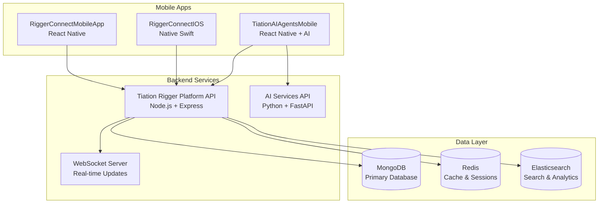

# Tiation Rigger Platform - Mobile Apps Integration 📱

## Overview

The Tiation Rigger Platform integrates with your existing iOS apps rather than creating new ones. This document outlines how to integrate the platform backend with your current mobile app ecosystem.

## Existing iOS Apps

### 1. RiggerConnectMobileApp (Primary B2B App)
- **Location**: `../tiation-rigger-workspace/RiggerConnectMobileApp/`
- **Framework**: React Native 0.80.1
- **Purpose**: Main business-facing mobile application
- **Features**: Job marketplace, equipment listings, business management

#### Integration Points
```javascript
// API Configuration for RiggerConnectMobileApp
const API_CONFIG = {
  baseURL: 'https://api.tiation-rigger.com',
  endpoints: {
    jobs: '/api/v1/jobs',
    equipment: '/api/v1/equipment',
    companies: '/api/v1/companies',
    auth: '/api/v1/auth'
  }
};
```

#### Required Updates
```bash
cd ../tiation-rigger-workspace/RiggerConnectMobileApp
npm install axios @reduxjs/toolkit react-redux socket.io-client
```

### 2. RiggerConnectIOS (Native Swift App)
- **Location**: `../tiation-rigger-connect-app/RiggerConnectIOS/`
- **Framework**: Native Swift with pre-compiled binaries
- **Purpose**: High-performance native iOS features
- **Features**: Advanced calculations, offline capabilities

#### Integration Points
```swift
// Swift API Configuration
struct APIConfig {
    static let baseURL = "https://api.tiation-rigger.com"
    static let socketURL = "wss://api.tiation-rigger.com"
    
    enum Endpoints {
        static let jobs = "/api/v1/jobs"
        static let equipment = "/api/v1/equipment"
        static let auth = "/api/v1/auth"
    }
}
```

#### Required Updates
- Add networking capabilities with URLSession
- Implement WebSocket connections for real-time updates
- Add Stripe SDK for payment processing

### 3. TiationAIAgentsMobile (AI-Powered App)
- **Location**: `../tiation-ai-agents/TiationAIAgentsMobile/`
- **Framework**: React Native with AI capabilities
- **Purpose**: AI-powered job matching and recommendations
- **Features**: Smart matching, predictive analytics

#### Integration Points
```javascript
// AI-specific API endpoints
const AI_API_CONFIG = {
  baseURL: 'https://ai-api.tiation-rigger.com',
  endpoints: {
    matching: '/api/v1/ai/job-matching',
    recommendations: '/api/v1/ai/recommendations',
    analytics: '/api/v1/ai/analytics'
  }
};
```

## Platform Integration Architecture



## Backend API Endpoints

### Authentication
```javascript
// JWT-based authentication for all apps
POST /api/v1/auth/login
POST /api/v1/auth/register
POST /api/v1/auth/refresh
POST /api/v1/auth/logout
```

### Job Management
```javascript
// Job marketplace endpoints
GET /api/v1/jobs
POST /api/v1/jobs
GET /api/v1/jobs/:id
PUT /api/v1/jobs/:id
DELETE /api/v1/jobs/:id
POST /api/v1/jobs/:id/apply
```

### Equipment Management
```javascript
// Equipment rental/sales endpoints
GET /api/v1/equipment
POST /api/v1/equipment
GET /api/v1/equipment/:id
PUT /api/v1/equipment/:id
DELETE /api/v1/equipment/:id
```

### User Management
```javascript
// User profile and company management
GET /api/v1/users/profile
PUT /api/v1/users/profile
GET /api/v1/companies
POST /api/v1/companies
```

## Real-time Features

### WebSocket Integration
```javascript
// Socket.io client setup for React Native apps
import io from 'socket.io-client';

const socket = io('https://api.tiation-rigger.com', {
  transports: ['websocket'],
  auth: {
    token: userToken
  }
});

// Listen for job updates
socket.on('job-update', (data) => {
  // Update UI with new job information
});

// Listen for equipment availability
socket.on('equipment-available', (data) => {
  // Notify user of equipment availability
});
```

### Push Notifications
```javascript
// Firebase Cloud Messaging setup
import messaging from '@react-native-firebase/messaging';

// Request permission
const authStatus = await messaging().requestPermission();

// Get FCM token
const fcmToken = await messaging().getToken();

// Send token to backend
await api.post('/api/v1/users/fcm-token', { token: fcmToken });
```

## Development Setup

### 1. Backend Setup
```bash
# Start the platform backend
cd backend
npm install
npm run dev
```

### 2. RiggerConnectMobileApp Updates
```bash
cd ../tiation-rigger-workspace/RiggerConnectMobileApp
npm install
npm install @stripe/stripe-react-native
npm install @react-native-firebase/app @react-native-firebase/messaging
npx react-native run-ios
```

### 3. TiationAIAgentsMobile Updates
```bash
cd ../tiation-ai-agents/TiationAIAgentsMobile
npm install
npm install axios react-redux @reduxjs/toolkit
npx react-native run-ios
```

### 4. RiggerConnectIOS Updates
```bash
cd ../tiation-rigger-connect-app/RiggerConnectIOS
# Open in Xcode and add required frameworks
open RiggerConnectIOS.xcodeproj
```

## API Integration Examples

### React Native Integration
```javascript
// services/api.js
import axios from 'axios';
import AsyncStorage from '@react-native-async-storage/async-storage';

const api = axios.create({
  baseURL: 'https://api.tiation-rigger.com',
  timeout: 10000,
});

// Add auth token to requests
api.interceptors.request.use(async (config) => {
  const token = await AsyncStorage.getItem('auth_token');
  if (token) {
    config.headers.Authorization = `Bearer ${token}`;
  }
  return config;
});

// Job service
export const jobService = {
  getJobs: () => api.get('/api/v1/jobs'),
  createJob: (data) => api.post('/api/v1/jobs', data),
  applyForJob: (jobId) => api.post(`/api/v1/jobs/${jobId}/apply`),
};
```

### Swift Integration
```swift
// APIService.swift
import Foundation

class APIService {
    private let baseURL = "https://api.tiation-rigger.com"
    private let session = URLSession.shared
    
    func fetchJobs() async throws -> [Job] {
        guard let url = URL(string: "\(baseURL)/api/v1/jobs") else {
            throw APIError.invalidURL
        }
        
        var request = URLRequest(url: url)
        request.addValue("Bearer \(authToken)", forHTTPHeaderField: "Authorization")
        
        let (data, _) = try await session.data(for: request)
        return try JSONDecoder().decode([Job].self, from: data)
    }
}
```

## Dark Neon Theme Integration

### React Native Theme
```javascript
// theme/colors.js
export const colors = {
  primary: '#00FFFF',      // Cyan
  secondary: '#FF00FF',    // Magenta
  background: '#0A0A1A',   // Deep Navy
  surface: '#1A1A2E',     // Dark Blue
  text: '#FFFFFF',        // White
  accent: '#00FF41',      // Neon Green
  gradient: ['#00FFFF', '#FF00FF'], // Cyan to Magenta
};
```

### iOS Theme
```swift
// Theme.swift
struct Theme {
    static let primaryColor = UIColor(hex: "#00FFFF")
    static let secondaryColor = UIColor(hex: "#FF00FF")
    static let backgroundColor = UIColor(hex: "#0A0A1A")
    static let surfaceColor = UIColor(hex: "#1A1A2E")
    static let textColor = UIColor.white
    static let accentColor = UIColor(hex: "#00FF41")
}
```

## Testing Strategy

### API Testing
```javascript
// __tests__/api.test.js
import { jobService } from '../services/api';

describe('Job Service', () => {
  test('should fetch jobs', async () => {
    const jobs = await jobService.getJobs();
    expect(jobs.data).toHaveLength(expect.any(Number));
  });
});
```

### Integration Testing
```bash
# Run integration tests
npm run test:integration

# Test API endpoints
npm run test:api
```

## Deployment

### App Store Deployment
```bash
# Build for iOS App Store
cd ../tiation-rigger-workspace/RiggerConnectMobileApp
npx react-native run-ios --configuration Release

# Build native Swift app
cd ../tiation-rigger-connect-app/RiggerConnectIOS
xcodebuild -project RiggerConnectIOS.xcodeproj -scheme RiggerConnectIOS -configuration Release
```

### Backend Deployment
```bash
# Deploy backend to production
cd backend
npm run build
npm run deploy
```

## Monitoring & Analytics

### App Performance
- Firebase Performance Monitoring
- Crashlytics for crash reporting
- Custom analytics for user behavior

### Backend Monitoring
- API response times
- Database performance
- Real-time connection monitoring

## Security Considerations

### Mobile App Security
- JWT token management
- Secure storage of sensitive data
- Certificate pinning for API calls
- Biometric authentication

### Backend Security
- Rate limiting
- Input validation
- SQL injection prevention
- HTTPS enforcement

## Future Enhancements

### Phase 1
- Enhanced real-time features
- Advanced push notifications
- Offline capabilities

### Phase 2
- AI-powered recommendations
- Advanced analytics
- IoT device integration

### Phase 3
- AR/VR features
- Blockchain integration
- Advanced ML models

---

**This integration approach leverages your existing mobile apps while providing a unified backend platform for all rigger-related services.**
